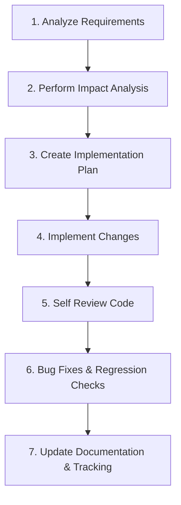

# AI Agent Workflow

This document outlines the mandatory 7-step workflow that every AI Agent must follow for all requests. Adhering to this process ensures stability, trackability, and consistent code quality.

---

## The 7-Step Process

### 1. Analyze Requirements
* Read the user request fully and understand the objective.
* Identify target screens, components, services, or modules that need changes.
* Review the existing implementation patterns in the workspace (refer to [CODING_RULES.md](file:///d:/Workspace/kintore-note/CODING_RULES.md)).
* Ask the user for clarification if the requirements are ambiguous or incomplete.

### 2. Perform Impact Analysis
* Trace dependencies and references of any files you plan to modify (e.g., using `grep_search`).
* Check if changes to a shared component, hook, utility, or Zustand store will affect other parts of the application.
* List potential side effects and plan mitigations.

### 3. Create an Implementation Plan
* Document the plan (especially for complex tasks) listing:
  * The file changes (e.g., modify, create, delete).
  * Design decisions and patterns to be used.
  * The verification plan (how to test).
* If the task is complex, wait for user feedback/approval before beginning implementation.

### 4. Implement the Changes
* Write clean, type-safe, and self-documenting code.
* Stick strictly to the scope of the request. Do not implement features or change logic outside the requested scope.
* Adhere to all guidelines outlined in [CODING_RULES.md](file:///d:/Workspace/kintore-note/CODING_RULES.md).

### 5. Self Review the Code
* Check for code quality: no unused imports, no console logs left in production, appropriate naming, and proper use of constants.
* Verify TypeScript compilation and lint rules (if applicable).
* Compare changes against the quality checklist in [CODING_RULES.md](file:///d:/Workspace/kintore-note/CODING_RULES.md).

### 6. Perform Bug Fixes & Regression Checks
* Run automated test suites (if available).
* Verify changes manually to ensure the UI renders correctly and interaction flows function as expected.
* Ensure no regressions or unintended behavioral side-effects were introduced in adjacent features.

### 7. Update Documentation & Task Tracking
* Maintain and update the [TRACKING_TASK.md](file:///d:/Workspace/kintore-note/TRACKING_TASK.md) file.
* Mark completed tasks with `✅ Done`.
* List all modified files, issues found during development, additional tasks discovered, and architectural notes or decisions made.
