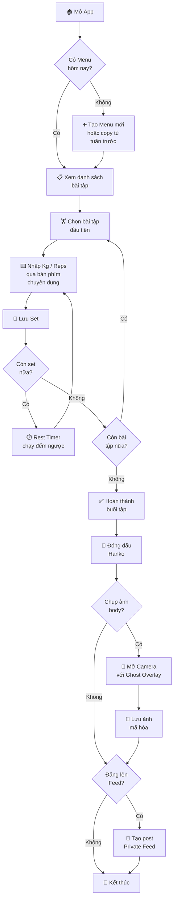
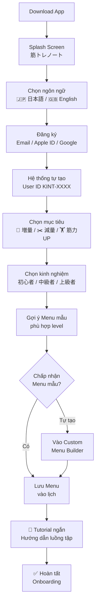
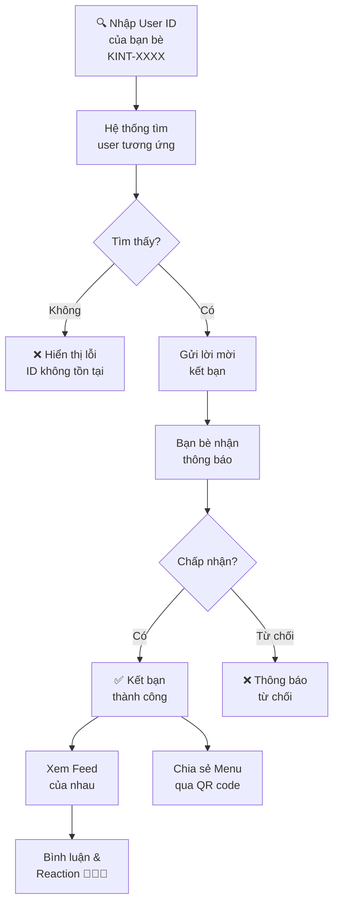
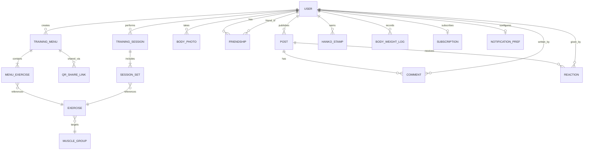
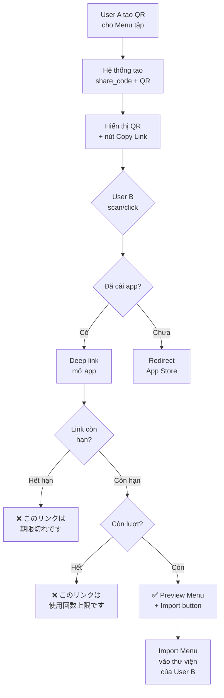

# 筋トレノート (Kintore Note) — Tài liệu Phân tích Nghiệp vụ

> **Phiên bản:** 1.2  
> **Ngày tạo:** 2026-04-19  
> **Cập nhật:** 2026-04-19 (v1.2 — Requirement Changes)  
> **Tác giả:** Business Analyst  
> **Trạng thái:** ✅ Updated — Sẵn sàng cho Implementation

---

## Mục lục

1. [Tổng quan & Bài toán cần giải quyết](#1-tổng-quan--bài-toán-cần-giải-quyết)
2. [User Personas](#2-user-personas)
3. [Use Cases chính](#3-use-cases-chính)
4. [User Flows](#4-user-flows)
5. [Yêu cầu chức năng (Functional Requirements)](#5-yêu-cầu-chức-năng-functional-requirements)
6. [Yêu cầu phi chức năng (Non-Functional Requirements)](#6-yêu-cầu-phi-chức-năng-non-functional-requirements)
7. [Cấu trúc dữ liệu (High-Level Data Model)](#7-cấu-trúc-dữ-liệu-high-level-data-model)
8. [Edge Cases & Rủi ro](#8-edge-cases--rủi-ro)
9. [Giả định & Quyết định đã xác nhận](#9-giả-định--quyết-định-đã-xác-nhận)
10. [Phụ lục](#10-phụ-lục)
    - [A. Hanko Tier System](#phụ-lục-a-hanko-tier-system)
    - [B. Muscle Group Taxonomy](#phụ-lục-b-phân-loại-nhóm-cơ-muscle-group-taxonomy)
    - [C. Glossary](#phụ-lục-c-glossary)
    - [D. Monetization Model](#phụ-lục-d-monetization-model-chi-tiết)
    - [E. Push Notification Strategy](#phụ-lục-e-push-notification-strategy)
    - [F. QR Code Sharing Design](#phụ-lục-f-qr-code-sharing-design)

---

## 1. Tổng quan & Bài toán cần giải quyết

### 1.1 Bối cảnh thị trường

Thị trường fitness Nhật Bản đang tăng trưởng mạnh, đặc biệt phân khúc "self-training" tại các phòng gym 24/7 giá rẻ (Anytime Fitness, chocoZAP, JOYFIT). Người dùng Nhật có đặc trưng:

- **Kỷ luật cao** nhưng cần hệ thống hỗ trợ duy trì thói quen
- **Chú trọng riêng tư** — ngại chia sẻ ảnh body lên mạng xã hội công khai
- **Văn hóa ghi chép** — thói quen "手帳" (techo/sổ tay) ăn sâu vào đời sống

### 1.2 Bài toán cần giải quyết

| # | Pain Point | Mô tả |
|---|-----------|-------|
| P1 | **Ghi chép rời rạc** | Người tập dùng giấy, Notes app, hoặc Excel → dữ liệu không cấu trúc, khó theo dõi tiến bộ |
| P2 | **Thiếu động lực duy trì** | Không có cơ chế "reward" phù hợp văn hóa Nhật → dễ bỏ tập sau 2-3 tuần |
| P3 | **Chia sẻ không an toàn** | Muốn khoe tiến bộ body nhưng sợ lộ trên Instagram/Twitter → không chia sẻ ở đâu cả |
| P4 | **Không biết mình thiếu gì** | Thiếu công cụ trực quan hóa mức độ cân bằng giữa các nhóm cơ |
| P5 | **Ảnh body không đồng nhất** | Mỗi lần chụp body một góc khác → không so sánh chính xác tiến bộ |

### 1.3 Mục tiêu sản phẩm

> **Tuyên bố sứ mệnh (Mission):** Trở thành cuốn "筋トレ手帳" (sổ tay gym) kỹ thuật số mà mọi người tập gym Nhật Bản đều muốn mở ra mỗi ngày.

**Mục tiêu cụ thể:**

| Mục tiêu | Chỉ số đo lường (KPI) | Mốc thời gian |
|----------|----------------------|---------------|
| Thu hút người dùng mới | 10,000 MAU | 6 tháng sau launch |
| Duy trì thói quen tập | Retention D30 ≥ 40% | 3 tháng sau launch |
| Tăng tương tác xã hội | 30% users có ≥1 friend | 6 tháng sau launch |
| Monetization | Conversion rate free→premium ≥ 5% | 9 tháng sau launch |

### 1.4 Giá trị cốt lõi (Core Values)

```
┌─────────────────────────────────────────────────────────────┐
│                    筋トレノート Values                       │
│                                                             │
│   📝 Kiroku (記録)    正確で高速な記録                       │
│   Ghi chép chính xác và nhanh chóng                         │
│                                                             │
│   🔖 Hanko (判子)     文化的モチベーション                    │
│   Tạo động lực qua văn hóa con dấu Nhật Bản                 │
│                                                             │
│   🔒 Privacy          プライベート接続                       │
│   Kết nối nhóm kín, không bao giờ công khai                 │
└─────────────────────────────────────────────────────────────┘
```

---

## 2. User Personas

### Persona 1: Takeshi (初心者 — Người mới bắt đầu)

| Thuộc tính | Chi tiết |
|-----------|---------|
| **Tuổi** | 26 tuổi, nhân viên IT tại Tokyo |
| **Kinh nghiệm gym** | 0–3 tháng |
| **Mục tiêu** | Tăng cân, xây dựng body từ gầy → khoẻ mạnh |
| **Hành vi** | Tập 3 buổi/tuần tại Anytime Fitness; hay quên ghi chép; chụp ảnh body nhưng lưu lộn xộn trong Camera Roll |
| **Pain points** | Không biết bắt đầu từ đâu; không biết mình có tiến bộ không; ngại hỏi người khác trong gym |
| **Motivator** | Streak & gamification; hướng dẫn rõ ràng; so sánh ảnh before/after |
| **Tech** | iPhone 15, luôn dùng Dark Mode, quen thuộc với các app Nhật |

**Jobs to be done:**
- *"Tôi muốn có một lịch tập mẫu để không phải nghĩ mỗi khi đến gym"*
- *"Tôi muốn thấy rõ mình đã tiến bộ so với 1 tháng trước"*
- *"Tôi muốn chụp ảnh body mà không lo nó xuất hiện ở thư viện ảnh"*

---

### Persona 2: Yuki (中級者 — Người tập trung cấp)

| Thuộc tính | Chi tiết |
|-----------|---------|
| **Tuổi** | 31 tuổi, designer freelance tại Osaka |
| **Kinh nghiệm gym** | 2–3 năm |
| **Mục tiêu** | Progressive Overload có hệ thống; chuẩn bị thi physique amateur |
| **Hành vi** | Tập 5 buổi/tuần, split routine; đang dùng Google Sheets để ghi log; có nhóm bạn gym 4-5 người thường xuyên chia sẻ menu tập |
| **Pain points** | Sheets khó thao tác trên điện thoại; muốn chia sẻ menu tập cho bạn dễ dàng; cần phân tích volume theo nhóm cơ |
| **Motivator** | Dữ liệu phân tích chi tiết; custom menu linh hoạt; kết nối nhóm kín |
| **Tech** | Android (Pixel 8), thích minimal UI |

**Jobs to be done:**
- *"Tôi muốn copy lịch tập tuần trước và tăng 2.5kg để progressive overload"*
- *"Tôi muốn gửi menu tập cho bạn bằng QR code ngay tại gym"*
- *"Tôi muốn xem nhóm cơ nào mình đang neglect qua Heatmap"*

---

### Persona 3: Kenji (トレーナー — Huấn luyện viên)

| Thuộc tính | Chi tiết |
|-----------|---------|
| **Tuổi** | 38 tuổi, personal trainer tại GOLD's GYM Shibuya |
| **Kinh nghiệm** | 10+ năm, NSCA-CPT certified |
| **Mục tiêu** | Tạo và quản lý menu tập cho 10–15 học viên; theo dõi tiến bộ từ xa |
| **Hành vi** | Viết lịch tập trên giấy rồi chụp ảnh gửi qua LINE; mất thời gian lặp lại cho mỗi học viên |
| **Pain points** | Không thể theo dõi học viên có thực sự tập đủ hay không; chia sẻ menu qua LINE rất lộn xộn |
| **Motivator** | Chia sẻ menu chuyên nghiệp; theo dõi streak của học viên; xây dựng uy tín cá nhân |
| **Tech** | iPhone, dùng nhiều app productivity |

**Jobs to be done:**
- *"Tôi muốn tạo menu mẫu và gửi cho học viên bằng 1 thao tác"*
- *"Tôi muốn biết học viên nào đang duy trì tập đều, học viên nào đang bỏ dở"*

> [!NOTE]
> Persona Kenji đại diện cho use case mở rộng (Phase 2). MVP nên focus vào Takeshi & Yuki.

---

## 3. Use Cases chính

### 3.1 Bảng tổng hợp Use Cases

| ID | Use Case | Actor chính | Ưu tiên | Module |
|----|---------|-------------|---------|--------|
| UC-01 | Tạo & quản lý lịch tập (Menu) | User | **P0** | Training Menu |
| UC-02 | Sao chép lịch tập từ ngày/tuần trước | User | **P0** | Training Menu |
| UC-03 | Ghi log bài tập (Kg, Reps, Sets) | User | **P0** | Training Log |
| UC-04 | Sử dụng Rest Timer | User | **P1** | Training Log |
| UC-05 | Đóng dấu Hanko sau buổi tập | User | **P0** | Hanko System |
| UC-06 | Chụp & lưu ảnh body riêng tư | User | **P0** | Body Records |
| UC-07 | So sánh ảnh body (Side-by-side) | User | **P1** | Body Records |
| UC-08 | Sử dụng Ghost Overlay khi chụp ảnh | User | **P1** | Body Records |
| UC-09 | Kết bạn qua User ID | User | **P1** | Private Circle |
| UC-10 | Đăng ảnh body lên Private Feed | User | **P1** | Private Circle |
| UC-11 | Bình luận & thả reaction | User | **P2** | Private Circle |
| UC-12 | Chia sẻ Menu tập qua QR/Link | User | **P1** | Private Circle |
| UC-13 | Xem Muscle Heatmap | User | **P1** | Analytics |
| UC-14 | Xem Volume Chart theo thời gian | User | **P1** | Analytics |
| UC-15 | Tra cứu thư viện thiết bị & hướng dẫn | User | **P1** | Equipment Library |
| UC-16 | Onboarding & đăng ký tài khoản | User | **P0** | Auth |

### 3.2 Chi tiết Use Cases trọng tâm

#### UC-03: Ghi log bài tập

```
Tên:           Ghi log bài tập (Kg, Reps, Sets)
Actor:         User
Precondition:  User đã đăng nhập; đã có Menu tập cho ngày hôm nay
Trigger:       User mở app tại phòng gym và chọn buổi tập hôm nay

Main Flow:
  1. Hệ thống hiển thị danh sách bài tập trong Menu ngày hôm nay
  2. User chọn bài tập đầu tiên
  3. Hệ thống hiển thị bàn phím số chuyên dụng với:
     - Input trọng lượng (kg) + nút tăng nhanh (+1.25, +2.5, +5)
     - Input số reps
     - Giá trị lần tập trước hiển thị mờ làm tham chiếu
  4. User nhập trọng lượng & reps → nhấn "記録" (Ghi)
  5. Hệ thống lưu set, tự động chuyển sang set tiếp theo
  6. User lặp lại bước 4-5 cho tất cả sets
  7. User nhấn "次の種目" (Bài tiếp) → chuyển sang bài tập kế tiếp
  8. Lặp lại bước 3-7 cho toàn bộ Menu

Alternative Flows:
  A1. User muốn thêm bài tập ngoài Menu:
      → Nhấn "+" → Tìm kiếm từ thư viện → Thêm vào buổi tập
  A2. User muốn bỏ qua bài tập:
      → Swipe left → Chọn "スキップ" (Skip)
  A3. User muốn thay đổi giá trị đã ghi:
      → Tap vào set đã ghi → Sửa → Lưu

Exception Flows:
  E1. Mất kết nối Internet:
      → Dữ liệu lưu local → Sync khi có mạng trở lại
  E2. App bị kill giữa chừng:
      → Tự động lưu draft; khi mở lại hiển thị "未完了のセッション" (Phiên chưa hoàn thành)

Postcondition: Tất cả sets được lưu; Buổi tập chuyển sang trạng thái "完了待ち" (Chờ hoàn tất)
```

#### UC-05: Đóng dấu Hanko

```
Tên:           Đóng dấu Hanko sau buổi tập
Actor:         User
Precondition:  User đã ghi log ≥1 bài tập trong buổi hôm nay
Trigger:       User nhấn "トレーニング完了" (Hoàn thành tập)

Main Flow:
  1. Hệ thống hiển thị tóm tắt buổi tập (tổng volume, thời gian, số bài tập)
  2. Hệ thống hiển thị animation dấu Hanko sẵn sàng "đóng"
  3. User thực hiện thao tác đóng dấu (tap & hold / press animation)
  4. Hệ thống:
     a. Hiển thị animation đóng dấu với hiệu ứng mực đỏ truyền thống
     b. Dấu Hanko được ghim vào lịch ngày hôm nay
     c. Cập nhật streak count
     d. Nếu đạt milestone streak → hiển thị celebration + unlock mẫu Hanko mới
  5. Hệ thống gợi ý: "ボディ写真を撮りますか？" (Bạn muốn chụp ảnh body không?)

Alternative Flows:
  A1. User đạt streak milestone (7, 30, 100 ngày):
      → Hiển thị full-screen celebration animation
      → Unlock mẫu Hanko cao cấp hơn
  A2. User break streak:
      → Hiển thị message khích lệ nhẹ nhàng (không phạt)
      → Reset streak counter, giữ nguyên mẫu Hanko đã unlock

Postcondition: Buổi tập chuyển sang "完了" (Hoàn thành); Lịch cập nhật dấu Hanko; Streak updated
```

#### UC-06: Chụp & lưu ảnh body riêng tư

```
Tên:           Chụp & lưu ảnh body riêng tư
Actor:         User
Precondition:  User đã cấp quyền Camera
Trigger:       User chọn "ボディ記録" từ menu hoặc sau khi đóng Hanko

Main Flow:
  1. Hệ thống mở Camera với Ghost Overlay (nếu có ảnh trước đó)
  2. User căn chỉnh body theo ghost overlay
  3. User chụp ảnh (hỗ trợ timer 3s/5s/10s)
  4. Hệ thống hiển thị preview với options:
     - Lưu vào kho riêng tư (mặc định)
     - Chụp lại
     - Chọn góc chụp khác (Front / Side / Back)
  5. User xác nhận lưu
  6. Hệ thống:
     a. Mã hóa ảnh (AES-256)
     b. Lưu vào đường dẫn riêng của App (KHÔNG lưu vào Camera Roll)
     c. Gắn metadata: ngày, góc chụp, body weight (nếu có)

Postcondition: Ảnh được mã hóa & lưu trong App; Không xuất hiện trong Gallery điện thoại
```

---

## 4. User Flows

### 4.1 Luồng chính: Một buổi tập hoàn chỉnh



### 4.2 Luồng Onboarding



### 4.3 Luồng kết bạn & tương tác Private Circle



---

## 5. Yêu cầu chức năng (Functional Requirements)

### 5.1 Module: Training Menu (トレーニングメニュー)

| ID | Requirement | Mô tả | Ưu tiên |
|----|------------|-------|---------|
| FR-MENU-01 | Lịch tập mẫu hệ thống | Cung cấp ≥5 template chuẩn (Full Body 3日, Push/Pull/Legs, Upper/Lower Split, etc.) phân loại theo level (初心者/中級者/上級者) | P0 |
| FR-MENU-02 | Custom Menu Builder | Cho phép user tạo lịch tập tùy chỉnh: chọn bài tập từ thư viện, sắp xếp thứ tự, set số sets/reps mục tiêu | P0 |
| FR-MENU-03 | Drag & Drop sắp xếp | Hỗ trợ kéo-thả để thay đổi thứ tự bài tập trong Menu | P1 |
| FR-MENU-04 | Copy Menu | Cho phép nhân bản Menu từ ngày/tuần trước; tự động tham chiếu giá trị cũ cho Progressive Overload | P0 |
| FR-MENU-05 | Gán Menu vào lịch | Cho phép gán 1 Menu vào 1 hoặc nhiều ngày trong tuần (recurring schedule) | P0 |
| FR-MENU-06 | Super Set / Circuit | Cho phép nhóm 2+ bài tập thành Super Set hoặc Circuit | P2 |
| FR-MENU-07 | Training Program (多週期メニュー) | Cho phép user tạo **chương trình tập dài hạn** với thời gian kéo dài tùy chỉnh (theo tuần, tháng). Mỗi chương trình gồm nhiều Phase, mỗi Phase chứa nhiều Menu khác nhau kéo dài N tuần. Hỗ trợ lên lịch theo pattern lặp (ví dụ: 8 tuần Bulking → 4 tuần Cutting). | P1 |

### 5.2 Module: Equipment Library (設備ライブラリ)

| ID | Requirement | Mô tả | Ưu tiên |
|----|------------|-------|---------|
| FR-EQUIP-01 | Danh mục bài tập | Thư viện ≥100 bài tập phân loại theo nhóm cơ chính (胸/背中/脚/肩/腕/腹) | P0 |
| FR-EQUIP-02 | Nội dung hướng dẫn | Mỗi bài tập có: Hình ảnh minh hoạ tối giản + Video ngắn (3-5s loop GIF) + Text hướng dẫn ngắn (JP + EN) | P1 |
| FR-EQUIP-03 | Tìm kiếm | Hỗ trợ tìm kiếm bằng tên Katakana, Kanji, Romaji và English | P0 |
| FR-EQUIP-04 | Bài tập tùy chỉnh | Cho phép user tạo bài tập custom (tên + nhóm cơ + ghi chú) | P1 |
| FR-EQUIP-05 | Offline access | Nội dung hướng dẫn có thể xem offline (tải trước) | P1 |

### 5.3 Module: Training Log (トレーニング記録)

| ID | Requirement | Mô tả | Ưu tiên |
|----|------------|-------|---------|
| FR-LOG-01 | Bàn phím số chuyên dụng | UI nhập liệu với: Input kg (hỗ trợ số thập phân 0.5), Input reps (số nguyên), nút tăng nhanh (+1.25, +2.5, +5 kg) | P0 |
| FR-LOG-02 | Tham chiếu lần trước | Hiển thị giá trị kg/reps của lần tập gần nhất cho cùng bài tập (mờ/nhỏ) để user reference | P0 |
| FR-LOG-03 | Rest Timer | Đồng hồ đếm ngược: default 60s/90s/120s; custom time; âm thanh "Soft Chime" kiểu Nhật khi hết giờ. **Chỉ hoạt động khi app ở foreground** — không chạy background/lock screen | P0 |
| FR-LOG-04 | Auto-save Draft | Tự động lưu session draft mỗi khi ghi 1 set; khôi phục khi app bị đóng bất ngờ | P0 |
| FR-LOG-05 | Ghi chú bài tập | Cho phép thêm ghi chú text ngắn cho mỗi bài tập (ví dụ: "コツ: 肘を固定" — mẹo: cố định khuỷu tay) | P1 |
| FR-LOG-06 | Skip & Reorder | Cho phép bỏ qua hoặc thay đổi thứ tự bài tập trong session đang tập | P1 |
| FR-LOG-07 | Session Summary | Sau khi kết thúc, hiển thị tóm tắt: tổng volume (kg × reps), tổng sets, thời gian tập, so sánh với lần trước | P0 |

### 5.4 Module: Hanko System (判子システム)

| ID | Requirement | Mô tả | Ưu tiên |
|----|------------|-------|---------|
| FR-HANKO-01 | Đóng dấu Hanko | Sau khi hoàn thành buổi tập, user tap để "đóng dấu" vào lịch ngày hôm nay | P0 |
| FR-HANKO-02 | Animation đóng dấu | Hiệu ứng đóng dấu mực đỏ truyền thống Nhật Bản (tactile feedback + visual) | P0 |
| FR-HANKO-03 | Streak Tracking | Đếm chuỗi ngày tập liên tiếp; hiển thị trên Home Screen | P0 |
| FR-HANKO-04 | Hanko Tier System | Mẫu dấu Hanko nâng cấp theo streak milestone (xem Phụ lục A) | P1 |
| FR-HANKO-05 | Lịch Hanko | Calendar view hiển thị tất cả ngày đã đóng dấu; trực quan hoá tần suất tập | P0 |
| FR-HANKO-06 | Streak Recovery | Cho phép "bù dấu" nếu quên đóng dấu trong vòng 24h (tối đa 1 lần/tháng cho free user, unlimited cho premium) | P2 |
| FR-HANKO-07 | Custom Hanko Name | Cho phép user custom dấu Hanko với tên hiển thị (display_name) khắc trên dấu — phong cách cá nhân hoá theo văn hóa 判子 truyền thống | P1 |

### 5.5 Module: Body Records (ボディ記録)

| ID | Requirement | Mô tả | Ưu tiên |
|----|------------|-------|---------|
| FR-BODY-01 | Kho ảnh riêng tư | Ảnh body lưu trữ encrypted trong App sandbox, không xuất hiện trong Camera Roll / Gallery | P0 |
| FR-BODY-02 | Camera với Ghost Overlay | Hiển thị ảnh body gần nhất (cùng góc) dưới dạng overlay mờ 30% trên viewfinder để căn chỉnh | P1 |
| FR-BODY-03 | Góc chụp | Hỗ trợ tag góc chụp: 正面 (Front), 側面 (Side), 背面 (Back) | P0 |
| FR-BODY-04 | Self-timer | Timer chụp tự động: 3s / 5s / 10s | P1 |
| FR-BODY-05 | Side-by-side Comparison | Chọn 2 ảnh cùng góc → hiển thị song song; hỗ trợ swipe slider | P1 |
| FR-BODY-06 | Timeline View | Hiển thị ảnh body theo dòng thời gian, filter theo góc chụp | P1 |
| FR-BODY-07 | Body Weight Log | Cho phép ghi cân nặng hàng ngày, hiển thị biểu đồ xu hướng | P1 |

### 5.6 Module: Private Circle (プライベートサークル)

| ID | Requirement | Mô tả | Ưu tiên |
|----|------------|-------|---------|
| FR-SOCIAL-01 | User ID System | Mỗi user có unique ID dạng `KINT-XXXX` (4 ký tự alphanumeric) **do hệ thống tự generate khi đăng ký**; không thể thay đổi sau khi tạo; không có chức năng gợi ý/khám phá người lạ | P0 |
| FR-SOCIAL-02 | Friend Request | Gửi/nhận lời mời kết bạn bằng User ID; yêu cầu chấp nhận 2 chiều | P0 |
| FR-SOCIAL-03 | Private Feed | Timeline chỉ hiển thị posts từ danh sách bạn bè; mỗi post gồm: ảnh body (optional) + tiêu đề ngắn (≤100 char) + bài tập summary | P1 |
| FR-SOCIAL-04 | Reactions | Thả emoji reaction: 💪 (Sức mạnh), 🔥 (Cháy), 💮 (Xuất sắc — hoa đào Nhật) | P1 |
| FR-SOCIAL-05 | Comments | Bình luận text trên post của bạn bè (≤200 char/comment) | P2 |
| FR-SOCIAL-06 | Menu Sharing | Chia sẻ Training Menu cho bạn bè qua: QR Code, In-app direct send | P1 |
| FR-SOCIAL-07 | Block & Report | Cho phép chặn user và báo cáo nội dung không phù hợp | P0 |
| FR-SOCIAL-08 | Unfriend | Cho phép hủy kết bạn; person bị xóa không nhận thông báo trực tiếp | P1 |
| FR-SOCIAL-09 | Block Hard-Hide | Khi user bị block, **ẩn hoàn toàn** mọi interaction cũ (comments, reactions) từ cả 2 phía. Dữ liệu soft-delete, không hiển thị trong UI | P0 |

### 5.7 Module: Analytics (分析)

| ID | Requirement | Mô tả | Ưu tiên |
|----|------------|-------|---------|
| FR-ANALYTICS-01 | Muscle Heatmap | Mô hình cơ thể 2D (trước + sau) với màu gradient thể hiện tổng volume theo nhóm cơ; range: 7 ngày / 30 ngày / tùy chỉnh | P1 |
| FR-ANALYTICS-02 | Volume Chart | Biểu đồ đường/cột thể hiện tổng volume (kg × reps) theo thời gian cho mỗi bài tập | P1 |
| FR-ANALYTICS-03 | Personal Records (PR) | Tự động phát hiện & đánh dấu khi user đạt kỷ lục cá nhân (max weight, max reps, max volume) | P1 |
| FR-ANALYTICS-04 | Weekly Summary | Thống kê tuần: tổng buổi tập, tổng volume, nhóm cơ được tập nhiều nhất, so sánh vs tuần trước | P2 |

### 5.8 Module: Authentication & Account

| ID | Requirement | Mô tả | Ưu tiên |
|----|------------|-------|---------|
| FR-AUTH-01 | Đăng ký/Đăng nhập | Hỗ trợ: Email + Password, Apple Sign-In, Google Sign-In | P0 |
| FR-AUTH-02 | User ID tự động | **Hệ thống tự generate** User ID dạng `KINT-XXXX` (alphanumeric) unique khi đăng ký. User **không thể tự chọn hay thay đổi** ID này — đảm bảo tính duy nhất và toàn vẹn hệ thống | P0 |
| FR-AUTH-03 | Profile | Tên hiển thị + Avatar (optional) + Bio ngắn; không bắt buộc thông tin cá nhân thật | P1 |
| FR-AUTH-04 | App Lock | Tùy chọn yêu cầu Face ID/Fingerprint khi mở App (bảo vệ ảnh body) | P1 |
| FR-AUTH-05 | Delete Account | Xóa toàn bộ dữ liệu theo GDPR / 個人情報保護法 (Luật APPI Nhật) | P0 |

---

## 6. Yêu cầu phi chức năng (Non-Functional Requirements)

### 6.1 Performance

| ID | Requirement | Chỉ số |
|----|------------|--------|
| NFR-PERF-01 | App launch time | Cold start ≤ 2s trên thiết bị từ 2021 trở lên |
| NFR-PERF-02 | Thời gian ghi log 1 set | ≤ 3 taps từ lúc nhập đến lưu xong |
| NFR-PERF-03 | Tải Feed | ≤ 1s cho 20 posts đầu tiên (khi có mạng) |
| NFR-PERF-04 | Offline ↔ Online sync | Sync hoàn thành ≤ 5s cho 1 tuần dữ liệu tập luyện |
| NFR-PERF-05 | Image encryption | ≤ 500ms cho ảnh ≤ 5MB |

### 6.2 Security & Privacy

| ID | Requirement | Mô tả |
|----|------------|-------|
| NFR-SEC-01 | Mã hóa ảnh body | AES-256 encryption cho tất cả ảnh body; key lưu trong Secure Enclave (iOS) / Keystore (Android) |
| NFR-SEC-02 | Truyền dữ liệu | TLS 1.3 cho mọi API call |
| NFR-SEC-03 | Hệ thống User ID | ID không chứa thông tin nhận dạng cá nhân; có thể thay đổi để chống quấy rối |
| NFR-SEC-04 | Lưu trữ server | Ảnh body mã hóa E2E — server không đọc được nội dung ảnh |
| NFR-SEC-05 | Tuân thủ pháp luật | APPI (個人情報保護法) của Nhật Bản; GDPR (nếu mở rộng EU) |
| NFR-SEC-06 | Biometric Lock | Hỗ trợ Face ID / Touch ID / Fingerprint để mở App |

### 6.3 Offline & Sync

| ID | Requirement | Mô tả |
|----|------------|-------|
| NFR-OFFLINE-01 | Ghi log offline | Ghi chép bài tập hoạt động đầy đủ khi không có mạng |
| NFR-OFFLINE-02 | Xem hướng dẫn offline | Nội dung Equipment Library đã tải về xem được offline |
| NFR-OFFLINE-03 | Conflict Resolution | Khi sync: Last-Write-Wins cho training log; server-side merge cho social data |
| NFR-OFFLINE-04 | Offline indicator | Hiển thị rõ ràng trạng thái offline và pending sync items |

### 6.4 Scalability

| ID | Requirement | Mô tả |
|----|------------|-------|
| NFR-SCALE-01 | Concurrent users | Hệ thống xử lý ≥ 10,000 concurrent users (peak: 6-9PM JST) |
| NFR-SCALE-02 | Data growth | Hỗ trợ ≥ 365 ngày lịch sử tập luyện / user mà không ảnh hưởng performance |
| NFR-SCALE-03 | Image storage | ≥ 1,000 ảnh body / user; tự động nén ảnh gốc sau 90 ngày |

### 6.5 Localization

| ID | Requirement | Mô tả |
|----|------------|-------|
| NFR-L10N-01 | Ngôn ngữ mặc định | Tiếng Nhật (ja-JP) |
| NFR-L10N-02 | Ngôn ngữ phụ | Tiếng Anh (en-US) |
| NFR-L10N-03 | Đơn vị | kg (mặc định), lbs (tùy chọn) |
| NFR-L10N-04 | Date format | YYYY年MM月DD日 (JP), YYYY-MM-DD (EN) |
| NFR-L10N-05 | Timezone | Hỗ trợ JST mặc định; tự detect timezone nếu user travel |

### 6.6 Accessibility & UX

| ID | Requirement | Mô tả |
|----|------------|-------|
| NFR-UX-01 | Dark Mode | Dark Mode là mặc định; Light Mode tùy chọn |
| NFR-UX-02 | Design | "Professional & Clean" — tối giản, monochrome chủ đạo với accent color |
| NFR-UX-03 | Font | Hỗ trợ Noto Sans JP / SF Pro cho readability |
| NFR-UX-04 | VoiceOver/TalkBack | Hỗ trợ cơ bản cho screen readers |
| NFR-UX-05 | Haptic Feedback | Vibration nhẹ khi đóng Hanko, ghi set thành công |

---

## 7. Cấu trúc dữ liệu (High-Level Data Model)

### 7.1 Entity Relationship Diagram



### 7.2 Chi tiết Entity chính

#### USER
| Field | Type | Constraint | Mô tả |
|-------|------|-----------|-------|
| id | UUID | PK | ID nội bộ |
| user_code | VARCHAR(8) | UNIQUE, NOT NULL | Public ID: `KINT-XXXX` |
| email | VARCHAR(255) | UNIQUE, NOT NULL | Email đăng ký |
| display_name | VARCHAR(50) | NOT NULL | Tên hiển thị |
| avatar_url | TEXT | NULLABLE | URL avatar |
| bio | VARCHAR(200) | NULLABLE | Giới thiệu ngắn |
| locale | ENUM('ja','en') | DEFAULT 'ja' | Ngôn ngữ |
| weight_unit | ENUM('kg','lbs') | DEFAULT 'kg' | Đơn vị trọng lượng |
| auth_provider | ENUM | NOT NULL | apple / google / email |
| created_at | TIMESTAMP | NOT NULL | Ngày tạo |
| last_active_at | TIMESTAMP | NOT NULL | Lần hoạt động cuối |
| streak_current | INT | DEFAULT 0 | Streak hiện tại |
| streak_best | INT | DEFAULT 0 | Streak cao nhất |

#### EXERCISE
| Field | Type | Constraint | Mô tả |
|-------|------|-----------|-------|
| id | UUID | PK | |
| name_ja | VARCHAR(100) | NOT NULL | Tên tiếng Nhật |
| name_en | VARCHAR(100) | NOT NULL | Tên tiếng Anh |
| muscle_group_id | UUID | FK | Nhóm cơ chính |
| secondary_muscles | UUID[] | | Nhóm cơ phụ |
| image_url | TEXT | | Hình minh họa |
| video_url | TEXT | | Video hướng dẫn |
| description_ja | TEXT | | Mô tả JP |
| description_en | TEXT | | Mô tả EN |
| is_system | BOOLEAN | DEFAULT true | Bài tập hệ thống vs user-created |
| created_by | UUID | FK, NULLABLE | NULL nếu system exercise |

#### TRAINING_MENU
| Field | Type | Constraint | Mô tả |
|-------|------|-----------|-------|
| id | UUID | PK | |
| user_id | UUID | FK | Chủ sở hữu |
| name | VARCHAR(100) | NOT NULL | Tên menu (ví dụ: "胸の日") |
| is_template | BOOLEAN | DEFAULT false | Template hệ thống? |
| schedule_days | INT[] | | Ngày trong tuần (0=Mon, 6=Sun) |
| program_id | UUID | FK, NULLABLE | Thuộc Training Program (nếu có) |
| program_week | INT | NULLABLE | Tuần thứ mấy trong program (1-based) |
| created_at | TIMESTAMP | NOT NULL | |
| updated_at | TIMESTAMP | NOT NULL | |

#### TRAINING_PROGRAM
| Field | Type | Constraint | Mô tả |
|-------|------|-----------|-------|
| id | UUID | PK | |
| user_id | UUID | FK | Chủ sở hữu |
| name | VARCHAR(100) | NOT NULL | Tên chương trình (ví dụ: "12週バルクアップ") |
| description | TEXT | NULLABLE | Mô tả mục tiêu chương trình |
| total_weeks | INT | NOT NULL | Tổng số tuần (1–52) |
| start_date | DATE | NULLABLE | Ngày bắt đầu (NULL = chưa lên lịch) |
| is_active | BOOLEAN | DEFAULT false | Đang chạy program này? |
| created_at | TIMESTAMP | NOT NULL | |
| updated_at | TIMESTAMP | NOT NULL | |

#### TRAINING_SESSION
| Field | Type | Constraint | Mô tả |
|-------|------|-----------|-------|
| id | UUID | PK | |
| user_id | UUID | FK | |
| menu_id | UUID | FK, NULLABLE | Menu gốc (nếu có) |
| started_at | TIMESTAMP | NOT NULL | Bắt đầu |
| completed_at | TIMESTAMP | NULLABLE | Kết thúc (NULL = đang tập) |
| total_volume | DECIMAL | | Tổng volume (kg × reps) |
| duration_minutes | INT | | Thời gian tập |
| status | ENUM | NOT NULL | draft / in_progress / completed |
| notes | TEXT | | Ghi chú buổi tập |

#### SESSION_SET
| Field | Type | Constraint | Mô tả |
|-------|------|-----------|-------|
| id | UUID | PK | |
| session_id | UUID | FK | |
| exercise_id | UUID | FK | |
| set_order | INT | NOT NULL | Thứ tự set |
| weight_kg | DECIMAL(6,2) | NOT NULL | Trọng lượng |
| reps | INT | NOT NULL | Số lần lặp |
| is_pr | BOOLEAN | DEFAULT false | Có phải PR? |
| rpe | INT | NULLABLE | Rating of Perceived Exertion (1-10) |
| created_at | TIMESTAMP | NOT NULL | |

#### BODY_PHOTO
| Field | Type | Constraint | Mô tả |
|-------|------|-----------|-------|
| id | UUID | PK | |
| user_id | UUID | FK | |
| encrypted_path | TEXT | NOT NULL | Đường dẫn file mã hóa |
| angle | ENUM | NOT NULL | front / side_left / side_right / back |
| taken_at | TIMESTAMP | NOT NULL | |
| body_weight_kg | DECIMAL(5,1) | NULLABLE | Cân nặng tại thời điểm chụp |

#### HANKO_STAMP
| Field | Type | Constraint | Mô tả |
|-------|------|-----------|-------|
| id | UUID | PK | |
| user_id | UUID | FK | |
| session_id | UUID | FK | Buổi tập tương ứng |
| stamp_date | DATE | NOT NULL | Ngày đóng dấu |
| hanko_tier | ENUM | NOT NULL | Tier dấu Hanko (xem Phụ lục A) |
| streak_count | INT | NOT NULL | Streak tại thời điểm đóng |

#### POST
| Field | Type | Constraint | Mô tả |
|-------|------|-----------|-------|
| id | UUID | PK | |
| user_id | UUID | FK | |
| session_id | UUID | FK, NULLABLE | Link tới buổi tập (optional) |
| photo_id | UUID | FK, NULLABLE | Ảnh body đính kèm |
| title | VARCHAR(100) | NOT NULL | Tiêu đề ngắn |
| visibility | ENUM | DEFAULT 'friends' | friends_only |
| created_at | TIMESTAMP | NOT NULL | |

#### FRIENDSHIP
| Field | Type | Constraint | Mô tả |
|-------|------|-----------|-------|
| id | UUID | PK | |
| requester_id | UUID | FK | Người gửi lời mời |
| addressee_id | UUID | FK | Người nhận lời mời |
| status | ENUM | NOT NULL | pending / accepted / blocked |
| created_at | TIMESTAMP | NOT NULL | |
| accepted_at | TIMESTAMP | NULLABLE | |

#### SUBSCRIPTION
| Field | Type | Constraint | Mô tả |
|-------|------|-----------|-------|
| id | UUID | PK | |
| user_id | UUID | FK, UNIQUE | 1 subscription/user |
| plan | ENUM | NOT NULL | monthly / semi_annual / lifetime |
| status | ENUM | NOT NULL | active / expired / cancelled |
| started_at | TIMESTAMP | NOT NULL | Ngày bắt đầu |
| expires_at | TIMESTAMP | NULLABLE | NULL nếu lifetime |
| store_transaction_id | VARCHAR(255) | NOT NULL | Apple App Store transaction ID |
| price_jpy | INT | NOT NULL | Giá tại thời điểm mua |
| created_at | TIMESTAMP | NOT NULL | |

#### NOTIFICATION_PREF
| Field | Type | Constraint | Mô tả |
|-------|------|-----------|-------|
| id | UUID | PK | |
| user_id | UUID | FK, UNIQUE | |
| training_reminder | BOOLEAN | DEFAULT true | Nhắc tập hàng ngày |
| reminder_time | TIME | DEFAULT '18:00' | Giờ nhắc |
| reminder_days | INT[] | | Ngày trong tuần (0=Mon..6=Sun) |
| streak_alert | BOOLEAN | DEFAULT true | Cảnh báo sắp mất streak |
| friend_activity | BOOLEAN | DEFAULT true | Bạn bè tương tác |
| weekly_summary | BOOLEAN | DEFAULT true | Tổng kết tuần |
| pr_celebration | BOOLEAN | DEFAULT true | Thông báo PR mới |

#### QR_SHARE_LINK
| Field | Type | Constraint | Mô tả |
|-------|------|-----------|-------|
| id | UUID | PK | |
| menu_id | UUID | FK | Menu được chia sẻ |
| created_by | UUID | FK | User tạo link |
| share_code | VARCHAR(16) | UNIQUE | Mã ngắn trong QR |
| created_at | TIMESTAMP | NOT NULL | |
| expires_at | TIMESTAMP | NOT NULL | created_at + 72h |
| max_uses | INT | DEFAULT 10 | Giới hạn lượt dùng |
| use_count | INT | DEFAULT 0 | Số lượt đã dùng |

---

## 8. Edge Cases & Rủi ro

### 8.1 Edge Cases

| # | Edge Case | Module | Xử lý đề xuất |
|---|----------|--------|---------------|
| EC-01 | User đóng app giữa buổi tập | Training Log | Auto-save draft mỗi khi ghi 1 set; hiển thị "Resume Session" khi mở lại |
| EC-02 | User tập 2 buổi trong 1 ngày | Hanko | Chỉ 1 Hanko/ngày; buổi thứ 2 vẫn ghi log nhưng không đóng dấu thêm |
| EC-03 | User thay đổi timezone (travel) | Hanko/Log | Dùng local timezone tại thời điểm đóng dấu; streak tính theo "calendar day" local |
| EC-04 | Conflict khi sync offline data | Sync | Training log: Last-Write-Wins; Social data: Server timestamp wins |
| EC-05 | User cố gửi friend request spam | Social | Rate limit: tối đa 10 requests/ngày; cooldown 24h cho rejected requests |
| EC-06 | Ảnh body bị corrupted/mất key | Body Records | Key backup qua iCloud Keychain / Google Backup; recovery flow rõ ràng |
| EC-07 | User nhập giá trị bất thường (999kg) | Training Log | Soft warning: "この重量は正しいですか？" (Trọng lượng này đúng chưa?); không hard block |
| EC-08 | User xóa account nhưng có posts trên feed bạn bè | Social | Anonymize posts (hiển thị "退会ユーザー") hoặc xóa hoàn toàn (theo APPI) |
| EC-09 | Ghost Overlay không có ảnh trước đó | Body Records | Hiển thị camera bình thường + hướng dẫn vị trí đứng bằng grid overlay |
| EC-10 | Menu chia sẻ chứa bài tập custom | Menu Sharing | Import bài tập custom cùng menu; nếu trùng tên → tạo bản copy |
| EC-11 | User đổi User ID khi đang có pending friend requests | Auth | Tự động update ID trong pending requests; thông báo cho requester |
| EC-12 | Đạt PR nhưng reps rất thấp (1 rep ở max weight) | Analytics | PR tracking theo nhiều category: max weight, max reps, max volume |

### 8.2 Rủi ro & Biện pháp giảm thiểu

| # | Rủi ro | Mức độ | Xác suất | Biện pháp giảm thiểu |
|---|--------|--------|----------|---------------------|
| R-01 | **Ảnh body bị leak** | 🔴 Rất cao | Thấp | E2E encryption; biometric lock; ảnh không lưu Camera Roll; penetration testing định kỳ |
| R-02 | **Streak hacking** — user fake dấu Hanko | 🟡 Trung bình | Trung bình | Yêu cầu ≥1 set ghi log để đóng dấu; server-side validation; không cho đóng dấu quá khứ (trừ Recovery) |
| R-03 | **Quấy rối qua Private Circle** | 🔴 Rất cao | Trung bình | Block/Report; User ID có thể đổi; moderation cho image posts (NSFW detection) |
| R-04 | **Mất dữ liệu offline chưa sync** | 🟡 Trung bình | Thấp | Auto-sync khi có mạng; local backup; hiển thị "X items pending sync" |
| R-05 | **App Store rejection** — Nhật rất nghiêm về APPI | 🔴 Rất cao | Trung bình | Review kỹ privacy policy; in-app consent flow; data deletion API compliant |
| R-06 | **Low retention** — user bỏ tập | 🟡 Trung bình | Cao | Hanko gamification; push notification nhẹ nhàng; weekly summary; friend accountability |
| R-07 | **Scalability issues** vào giờ cao điểm (18:00-21:00 JST) | 🟡 Trung bình | Trung bình | Auto-scaling infrastructure; read replicas; CDN cho media; monitoring/alerts |
| R-08 | **Content moderation** — ảnh body không phù hợp trên Feed | 🔴 Rất cao | Thấp | AI-based NSFW detection trước khi publish; report mechanism; human review queue |

---

## 9. Giả định & Quyết định đã xác nhận

### 9.1 Giả định (Assumptions)

| # | Giả định | Ảnh hưởng nếu sai |
|---|---------|-------------------|
| A-01 | Platform: React Native / Expo cho cả iOS và Android | Cần đánh giá lại nếu native performance là bắt buộc (đặc biệt camera/encryption) |
| A-02 | Backend: Supabase hoặc Firebase cho MVP, chuyển sang dedicated server khi scale | Cần thiết kế abstraction layer từ đầu để dễ migrate |
| A-03 | ✅ **Target launch: iOS 16+ trước** — Android sẽ xem xét sau. Tập trung toàn bộ QA cho iOS | Đã xác nhận bởi stakeholder |
| A-04 | ✅ **Monetization: Subscription model** — 3 tiers: Monthly, Semi-annual, Lifetime (xem Phụ lục D) | Đã xác nhận bởi stakeholder |
| A-05 | User ID format `KINT-XXXX` — **chỉ alphanumeric** (A-Z, 0-9), **do hệ thống tự generate**, không thể thay đổi sau khi tạo | Cập nhật v1.2 |
| A-06 | Rest Timer **chỉ hoạt động foreground** — không chạy background/lock screen, không cần Watch app | Đã xác nhận bởi stakeholder |
| A-07 | Thư viện bài tập ban đầu ~100-150 bài do team biên soạn, không crowdsource | Cần content team hoặc outsource cho fitness expert Nhật Bản |
| A-08 | NSFW detection sử dụng third-party API (Google Cloud Vision/AWS Rekognition) | Chi phí API cần budget riêng |
| A-09 | ✅ **Không tích hợp thiết bị đo** (smart scale, Apple Health, Google Fit) trong MVP | Đã xác nhận bởi stakeholder — có thể xem xét trong Phase 2 |
| A-10 | ✅ **Feed chỉ hỗ trợ ảnh tĩnh + text** — không hỗ trợ video | Đã xác nhận bởi stakeholder — giảm đáng kể chi phí storage/bandwidth |

### 9.2 Quyết định đã xác nhận (Resolved Decisions)

> [!NOTE]
> Tất cả 12 Open Questions đã được stakeholder trả lời vào 2026-04-19. Dưới đây là tổng hợp quyết định.

| # | Câu hỏi gốc | Quyết định | Tác động lên thiết kế |
|---|------------|-----------|----------------------|
| Q-01 | Monetization model? | **Subscription**: Monthly / Semi-annual / Lifetime. Free tier có giới hạn (xem Phụ lục D) | Thêm entity `SUBSCRIPTION`; feature gating logic; App Store IAP integration |
| Q-02 | User ID ký tự Nhật? | **Chỉ alphanumeric** `KINT-[A-Z0-9]{4}`, **hệ thống tự generate** — user không thể chỉnh sửa | Server-side generation lúc đăng ký; không có change-user-code endpoint |
| Q-03 | Ảnh body sync cloud? | **Có** — sync lên cloud service (sẽ quyết định provider sau) | Cần thiết kế E2E encryption pipeline; cloud storage abstraction layer |
| Q-04 | Rest Timer background? | **Không** — chỉ foreground | Không cần background mode permission; đơn giản hóa Apple review |
| Q-05 | Custom Hanko design? | **Có** — user custom Hanko theo tên (display_name khắc trên dấu) | Thêm FR-HANKO-07; font rendering cho tên trên dấu Hanko; không cần UGC moderation (chỉ text tên) |
| Q-06 | Tích hợp thiết bị đo? | **Không** trong MVP | Giảm scope; không cần HealthKit/Google Fit permissions |
| Q-07 | Feed có video? | **Không** — chỉ ảnh tĩnh + text | Đơn giản hóa media pipeline; giảm storage cost ~60-80% |
| Q-08 | Target devices? | **iOS 16+** trước; Android xem xét sau | Tập trung testing matrix; dùng được SwiftUI concurrent features |
| Q-09 | Push notification? | **Có** — user tùy chỉnh hoàn toàn (xem Phụ lục E) | Thêm entity `NOTIFICATION_PREF`; APNs integration; settings UI |
| Q-10 | Admin panel? | **Có** — web dashboard cho content management, moderation, analytics | Thêm scope: web application (React/Next.js); admin API endpoints |
| Q-11 | QR Code expiry? | **Có** — hết hạn sau **72 giờ**, tối đa **10 lượt** dùng (xem Phụ lục F) | Thêm entity `QR_SHARE_LINK`; cleanup cron job |
| Q-12 | Block ẩn interaction cũ? | **Có** — **hard-hide hoàn toàn** mọi comments, reactions từ cả 2 phía | Soft-delete pattern; filtered queries; thêm FR-SOCIAL-09 |

---

## 10. Phụ lục

### Phụ lục A: Hanko Tier System

| Streak | Tier | Tên | Mô tả mẫu dấu |
|--------|------|-----|----------------|
| 1–6 ngày | 🥉 Bronze | 初心 (Shoshin) | Dấu tròn đơn giản, mực đỏ nhạt |
| 7–29 ngày | 🥈 Silver | 継続 (Keizoku) | Dấu hoa văn nhẹ, mực đỏ đậm |
| 30–89 ngày | 🥇 Gold | 鍛錬 (Tanren) | Dấu chạm khắc chi tiết, viền vàng |
| 90–179 ngày | 💎 Platinum | 精進 (Shōjin) | Dấu phong cách Edo, hiệu ứng ánh lửa |
| 180–364 ngày | 🏯 Master | 達人 (Tatsujin) | Dấu phong cách hoàng gia, particle effect |
| 365+ ngày | 👑 Legend | 伝説 (Densetsu) | Dấu animated đặc biệt, full-screen celebration |

### Phụ lục B: Phân loại nhóm cơ (Muscle Group Taxonomy)

| ID | Tên JP | Tên EN | Bài tập tiêu biểu |
|----|--------|--------|-------------------|
| MG-01 | 胸 (Mune) | Chest | ベンチプレス, ダンベルフライ |
| MG-02 | 背中 (Senaka) | Back | デッドリフト, ラットプルダウン |
| MG-03 | 脚 (Ashi) | Legs | スクワット, レッグプレス |
| MG-04 | 肩 (Kata) | Shoulders | ショルダープレス, サイドレイズ |
| MG-05 | 腕 (Ude) | Arms | バーベルカール, トライセプスプレスダウン |
| MG-06 | 腹 (Hara) | Core/Abs | プランク, アブローラー |
| MG-07 | 臀部 (Denbu) | Glutes | ヒップスラスト, ブルガリアンスクワット |

### Phụ lục C: Glossary

| Thuật ngữ | Tiếng Nhật | Giải thích |
|----------|-----------|-----------|
| Progressive Overload | 漸進性過負荷 | Tăng dần trọng lượng/reps/sets theo thời gian |
| Volume | 総負荷量 | Tổng trọng lượng × số reps trong 1 buổi/tuần |
| PR (Personal Record) | 自己ベスト | Kỷ lục cá nhân cho 1 bài tập cụ thể |
| Streak | 連続記録 | Chuỗi ngày tập liên tiếp không nghỉ |
| RPE | 主観的運動強度 | Thang đo cảm nhận mức độ nặng (1-10) |
| Split Routine | 分割法 | Chia nhóm cơ ra các ngày khác nhau trong tuần |
| Super Set | スーパーセット | Tập 2 bài liên tiếp không nghỉ giữa |

### Phụ lục D: Monetization Model chi tiết

#### Đề xuất Subscription Tiers

| | 🆓 Free | ⭐ Pro Monthly | 💎 Pro Semi-annual | 👑 Pro Lifetime |
|---|---------|---------------|-------------------|----------------|
| **Giá** | ¥0 | ¥480/tháng | ¥1,900/6 tháng (~¥317/tháng) | ¥4,800 một lần |
| **Training Log** | ✅ Không giới hạn | ✅ Không giới hạn | ✅ Không giới hạn | ✅ Không giới hạn |
| **Custom Menu** | ✅ Tối đa 3 menus | ✅ Không giới hạn | ✅ Không giới hạn | ✅ Không giới hạn |
| **Training Program** | ❌ | ✅ Không giới hạn | ✅ Không giới hạn | ✅ Không giới hạn |
| **Hanko & Streak** | ✅ Basic tiers | ✅ All tiers + Custom name | ✅ All tiers + Custom name | ✅ All tiers + Custom name |
| **Body Photos** | ✅ Tối đa 50 ảnh | ✅ Không giới hạn | ✅ Không giới hạn | ✅ Không giới hạn |
| **Cloud Sync ảnh** | ❌ Local only | ✅ E2E encrypted cloud | ✅ E2E encrypted cloud | ✅ E2E encrypted cloud |
| **Ghost Overlay** | ❌ | ✅ | ✅ | ✅ |
| **Analytics** | 📊 Volume Chart (7 ngày) | 📊 Full charts + Heatmap | 📊 Full charts + Heatmap | 📊 Full charts + Heatmap |
| **PR Tracking** | ✅ Basic (max weight) | ✅ Multi-category | ✅ Multi-category | ✅ Multi-category |
| **Weekly Summary** | ❌ | ✅ | ✅ | ✅ |
| **Export CSV** | ❌ | ✅ | ✅ | ✅ |
| **Streak Recovery** | 1 lần/tháng | Không giới hạn | Không giới hạn | Không giới hạn |
| **Private Circle** | ✅ Tối đa 5 friends | ✅ Tối đa 50 friends | ✅ Tối đa 50 friends | ✅ Tối đa 50 friends |
| **QR Menu Share** | ❌ | ✅ | ✅ | ✅ |
| **Quảng cáo** | Không có (clean UX) | Không có | Không có | Không có |

> [!TIP]
> **Chiến lược giá:** Benchmark với thị trường Nhật — các app fitness phổ biến (Muscle, FitNotes) thường ở mức ¥400-600/tháng. Giá ¥480/tháng nằm trong vùng competitive. Semi-annual discount ~34% tạo incentive upgrade. Lifetime cap ở 10x monthly để tối ưu LTV.

> [!IMPORTANT]
> **Nguyên tắc Free tier:** Core logging (ghi chép bài tập) KHÔNG bị giới hạn — đảm bảo free users vẫn có trải nghiệm đủ tốt để duy trì thói quen. Giới hạn tập trung vào convenience features (cloud sync, advanced analytics, social expansion).

---

### Phụ lục E: Push Notification Strategy

#### Các loại thông báo

| # | Loại | Trigger | Nội dung mẫu (JP) | Tần suất | Default | User tùy chỉnh |
|---|------|---------|-------------------|----------|---------|----------------|
| PN-01 | **Training Reminder** | Đến giờ tập (user setting) | 「今日のトレーニングの時間です！💪」 | 1 lần/ngày vào giờ đã set | ✅ ON, 18:00 | Giờ, ngày trong tuần |
| PN-02 | **Streak Alert** | 21:00 JST nếu chưa tập hôm nay & streak ≥ 3 | 「あと3時間で連続記録が途切れます！🔥 現在: 14日連続」 | Tối đa 1/ngày | ✅ ON | ON/OFF |
| PN-03 | **Friend Activity** | Bạn bè reaction/comment post | 「ユキさんが💪をくれました」 | Realtime, batch nếu nhiều | ✅ ON | ON/OFF |
| PN-04 | **Weekly Summary** | Chủ nhật 20:00 JST | 「今週のまとめ: 4回トレーニング、総ボリューム 12,500kg 📊」 | 1 lần/tuần | ✅ ON | ON/OFF |
| PN-05 | **PR Celebration** | Khi đạt Personal Record | 「新記録！🎉 ベンチプレス: 80kg達成！」 | Event-based | ✅ ON | ON/OFF |

#### Nguyên tắc thiết kế

- **Tone:** Khích lệ nhẹ nhàng, không aggressive. Sử dụng 敬語 (keigo) level thông thường
- **Tần suất tối đa:** Không quá 3 notifications/ngày (tất cả loại cộng lại)
- **Quiet Hours:** Tự động tắt 22:00 – 07:00 JST (user có thể điều chỉnh)
- **Giảm dần:** Nếu user không mở app từ notification 5 lần liên tiếp → giảm frequency xuống 1/2
- **Re-engagement:** Nếu user không tập 7+ ngày → gửi 1 message khích lệ duy nhất, sau đó dừng hoàn toàn cho đến khi user mở app trở lại

#### Settings UI

```
通知設定 (Notification Settings)
├── トレーニングリマインダー  [ON/OFF]  ⏰ 18:00  📅 月火水木金
├── 連続記録アラート          [ON/OFF]
├── フレンド活動              [ON/OFF]
├── 週間まとめ                [ON/OFF]
├── 自己ベスト通知            [ON/OFF]
└── おやすみ時間              ⏰ 22:00 - 07:00
```

---

### Phụ lục F: QR Code Sharing Design

#### Thông số kỹ thuật

| Thuộc tính | Giá trị | Lý do |
|-----------|---------|-------|
| **Thời hạn (Expiry)** | 72 giờ (3 ngày) | Đủ thời gian chia sẻ trong gym/group chat LINE; ngắn đủ để không bị lạm dụng |
| **Giới hạn lượt dùng** | 10 lượt / QR code | Phù hợp với use case chia sẻ nhóm nhỏ (nhóm bạn gym 4-5 người + dư 5 lượt) |
| **Format URL** | `kintore://menu/{share_code}` | Deep link mở thẳng app |
| **Fallback URL** | `https://kintore.app/s/{share_code}` | Nếu chưa cài app → redirect App Store |
| **QR Code size** | 200×200px, Error Correction Level M | Đủ scan ở khoảng cách 30cm trên màn hình điện thoại |

#### Luồng chia sẻ



#### Cleanup

- **Cron job:** Chạy mỗi 6 giờ, xóa (hard delete) các `QR_SHARE_LINK` đã hết hạn > 7 ngày
- **Rate limit:** Mỗi user tạo tối đa 5 QR codes/ngày (chống spam)

---

> [!NOTE]
> **Bước tiếp theo:**
> 1. ~~Stakeholder review & trả lời Open Questions~~ ✅ Đã hoàn thành
> 2. Xác định MVP scope (P0 features only vs P0+P1)
> 3. Chuyển sang **Technical Specification** & **Implementation Plan**
> 4. Thiết kế **Admin Panel** scope & features
> 5. Wireframe / UI Design cho các screen chính
