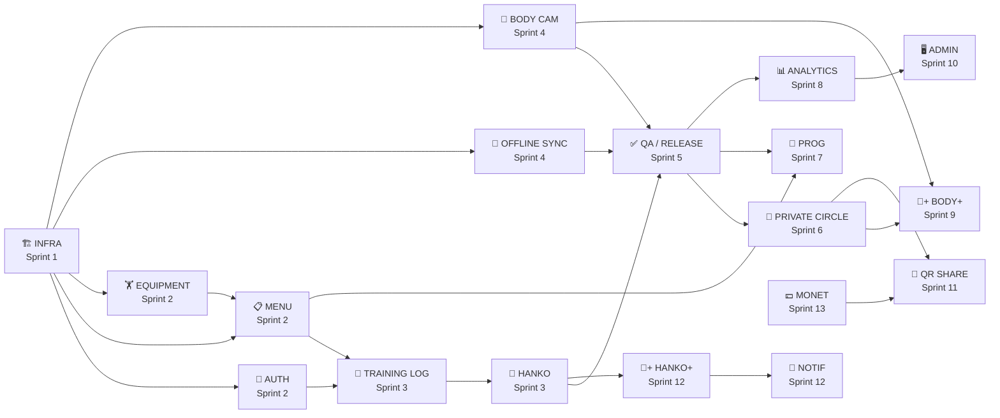

# 筋トレノート (Kintore Note) — Development Plan

> **Phiên bản:** 1.0  
> **Ngày tạo:** 2026-04-19  
> **Tham chiếu:** [Technical Specification v1.1](./technical-specification.md) · [Business Analysis v1.2](./business-analysis.md)  
> **Trạng thái:** Draft — Chờ Tech Lead review

---

## Mục lục

1. [Tổng quan Timeline](#1-tổng-quan-timeline)
2. [Phase 1 — MVP](#2-phase-1--mvp)
3. [Phase 2 — Social & Analytics](#3-phase-2--social--analytics)
4. [Phase 3 — Advanced](#4-phase-3--advanced)
5. [Dependency Graph](#5-dependency-graph)
6. [Technical Risk Register](#6-technical-risk-register)
7. [Definition of Done](#7-definition-of-done)

---

## 1. Tổng quan Timeline

```
Phase 1 — MVP             : 17 tuần (Sprint 1–5)   → App Store Submit
Phase 2 — Social          : 19 tuần (Sprint 6–10)  → Update 2.0
Phase 3 — Advanced        : 10 tuần (Sprint 11–13) → Update 3.0
```

### Team assumptions

| Role | Số lượng | Trách nhiệm |
|------|---------|-------------|
| Mobile Dev | 2 | React Native / Expo, WatermelonDB, Animations |
| Backend Dev | 1 | Supabase schema, Edge Functions, RLS |
| Design | 1 (part-time) | UI mockups, Design System tokens |
| QA | 1 (from Sprint 3) | Manual + Detox E2E |

> **Sprint length:** 2 tuần · **Velocity giả định:** ~80 giờ dev/sprint (2 mobile devs)

---

## 2. Phase 1 — MVP

**Mục tiêu:** User có thể tạo menu tập, ghi log, đóng Hanko, lưu ảnh body riêng tư. **Offline hoàn toàn.**

### Sprint 1: Infrastructure & Foundation (Tuần 1–2)

**Mục tiêu sprint:** Setup toàn bộ nền tảng kỹ thuật. Dev có thể chạy app trên thiết bị.

#### INFRA-01: Project Setup

| Task | Ưu tiên | Giờ | Assignee |
|------|--------|-----|---------|
| `npx create-expo-app` + cấu hình Hermes New Architecture | 🔴 P0 | 2h | Mobile |
| Setup Expo Router v4 file structure (tabs, auth, modals) | 🔴 P0 | 3h | Mobile |
| Cấu hình TypeScript strict mode + ESLint + Prettier | 🔴 P0 | 2h | Mobile |
| Setup absolute imports (`src/` alias) | 🟡 P1 | 1h | Mobile |
| Setup jest + React Testing Library baseline | 🟡 P1 | 2h | Mobile |
| **[Backend]** Tạo Supabase project + region `ap-northeast-1` (Tokyo) | 🔴 P0 | 1h | Backend |

#### INFRA-02: Design System

| Task | Ưu tiên | Giờ | Assignee |
|------|--------|-----|---------|
| Implement `constants/colors.ts` (Dark theme tokens, Hanko red) | 🔴 P0 | 2h | Mobile |
| Implement `constants/typography.ts` (NotoSansJP + SF Pro) | 🔴 P0 | 2h | Mobile |
| Implement `constants/spacing.ts` + `radius.ts` | 🔴 P0 | 1h | Mobile |
| Build atomic UI components: `Button`, `Input`, `Card`, `Badge` | 🔴 P0 | 6h | Mobile |
| Build `Header`, `EmptyState`, `LoadingSpinner` layout components | 🟡 P1 | 3h | Mobile |
| Setup i18n (i18next): `ja.json` skeleton + `en.json` skeleton | 🟡 P1 | 3h | Mobile |

#### INFRA-03: Database & Backend Foundation

| Task | Ưu tiên | Giờ | Assignee |
|------|--------|-----|---------|
| **[Backend]** Migration: ENUMs, `profiles`, `muscle_groups`, `exercises` | 🔴 P0 | 4h | Backend |
| **[Backend]** Migration: `training_programs`, `training_menus`, `menu_exercises` | 🔴 P0 | 3h | Backend |
| **[Backend]** Migration: `training_sessions`, `session_sets`, `hanko_stamps`, `body_photos` | 🔴 P0 | 3h | Backend |
| **[Backend]** Implement `generate_user_code()` + `trg_check_pr` + `trg_update_volume` | 🔴 P0 | 3h | Backend |
| **[Backend]** Enable RLS + policies cơ bản (own data only) | 🔴 P0 | 3h | Backend |
| **[Backend]** Seed data: 7 muscle groups + ≥100 exercises (JP + EN) | 🔴 P0 | 8h | Backend |
| Setup `@supabase/supabase-js` client trong app | 🔴 P0 | 1h | Mobile |
| Setup WatermelonDB: schema v1 (`training_sessions`, `session_sets`, `hanko_stamps`) | 🔴 P0 | 4h | Mobile |

**Sprint 1 total:** ~57h · **Deliverable:** App chạy được, DB schema hoàn chỉnh, Design System cơ bản

---

### Sprint 2: Auth & Training Menu (Tuần 3–6)

> Sprint 2 kéo dài 4 tuần do scope lớn. Có thể tách 2A (Auth, 2 tuần) và 2B (Menu, 2 tuần).

#### AUTH-01: Authentication Flow

| Task | Ưu tiên | Giờ | Assignee | Dependency |
|------|--------|-----|---------|-----------|
| **[Backend]** Edge Function `/auth/register`: tạo profile + `generate_user_code()` | 🔴 P0 | 4h | Backend | INFRA-03 |
| Login screen: Email + Apple Sign-In | 🔴 P0 | 5h | Mobile | Auth BE |
| Register screen: form validation + call `/auth/register` + hiển thị KINT-XXXX | 🔴 P0 | 4h | Mobile | Auth BE |
| Onboarding screen: goal + level + gợi ý menu mẫu | 🔴 P0 | 5h | Mobile | MENU-02 |
| Auth guard: redirect unauthenticated users về Login | 🔴 P0 | 2h | Mobile | — |
| Zustand `auth.store.ts`: lưu session, refresh token | 🔴 P0 | 3h | Mobile | — |
| Delete Account flow (Settings → Account) | 🔴 P0 | 3h | Mobile | — |
| Unit tests: auth store, register validation | 🟡 P1 | 3h | Mobile | — |

#### MENU-01: Equipment Library

| Task | Ưu tiên | Giờ | Assignee | Dependency |
|------|--------|-----|---------|-----------|
| **[Backend]** Edge Function `/exercises/search`: full-text search tsvector | 🔴 P0 | 3h | Backend | INFRA-03 |
| Exercise Library screen: SectionList phân theo nhóm cơ | 🔴 P0 | 5h | Mobile | MENU BE |
| Search bar với debounce 300ms + highlight kết quả | 🔴 P0 | 3h | Mobile | — |
| Exercise Detail screen: hình ảnh + mô tả JP/EN | 🔴 P0 | 3h | Mobile | — |
| Offline cache: exercises WatermelonDB | 🟡 P1 | 3h | Mobile | WatermelonDB |
| `ExerciseCard` component | 🔴 P0 | 2h | Mobile | Design System |

#### MENU-02: Training Menu Builder

| Task | Ưu tiên | Giờ | Assignee | Dependency |
|------|--------|-----|---------|-----------|
| Menu Builder screen: thêm/sắp xếp bài tập, target sets/reps | 🔴 P0 | 8h | Mobile | MENU-01 |
| Template picker: ≥5 templates phân theo level | 🔴 P0 | 4h | Mobile | Seed data |
| Copy Menu flow: nhân bản + populate last values | 🔴 P0 | 4h | Mobile | — |
| Gán menu vào ngày trong tuần (recurring schedule) | 🔴 P0 | 3h | Mobile | — |
| CRUD menu: tạo, sửa, xóa (Supabase + WatermelonDB) | 🔴 P0 | 4h | Mobile | WatermelonDB |
| `MenuCard` component | 🟡 P1 | 2h | Mobile | — |
| Unit tests: copy menu logic, schedule validation | 🟡 P1 | 2h | Mobile | — |

**Sprint 2 total:** ~76h · **Deliverable:** Login/Register, Exercise Library, Menu Builder hoạt động

---

### Sprint 3: Training Log + Hanko System (Tuần 7–10)

#### LOG-01: Training Session Core

| Task | Ưu tiên | Giờ | Assignee | Dependency |
|------|--------|-----|---------|-----------|
| **[Backend]** Edge Function `/training/complete-session` | 🔴 P0 | 5h | Backend | — |
| **[Backend]** Edge Function `/training/session-summary` | 🔴 P0 | 4h | Backend | — |
| Active Session screen: danh sách bài tập + set tracking | 🔴 P0 | 6h | Mobile | MENU-02 |
| Custom Numpad component: kg (±1.25/±2.5/±5) + reps (±1) | 🔴 P0 | 5h | Mobile | Design System |
| "Tham chiếu lần trước" — query last session_set (WatermelonDB) | 🔴 P0 | 3h | Mobile | WatermelonDB |
| Auto-save draft mỗi set | 🔴 P0 | 3h | Mobile | WatermelonDB |
| Resume session khi app bị kill | 🔴 P0 | 3h | Mobile | Auto-save |
| Session Summary Modal: tổng volume, thời gian, so sánh | 🔴 P0 | 4h | Mobile | Backend EF |
| `SetRow` component | 🔴 P0 | 3h | Mobile | Design System |

#### LOG-02: Rest Timer

| Task | Ưu tiên | Giờ | Assignee | Dependency |
|------|--------|-----|---------|-----------|
| `use-rest-timer` hook: countdown start/pause/reset | 🔴 P0 | 3h | Mobile | — |
| Rest Timer UI: preset 60/90/120s + custom + âm thanh Chime | 🔴 P0 | 3h | Mobile | Hook |
| Haptic feedback khi hết giờ | 🟡 P1 | 1h | Mobile | — |
| Auto-show timer sau mỗi set hoàn thành | 🟡 P1 | 2h | Mobile | LOG-01 |
| Unit tests: timer logic | 🟡 P1 | 2h | Mobile | — |

#### HANKO-01: Hanko System

| Task | Ưu tiên | Giờ | Assignee | Dependency |
|------|--------|-----|---------|-----------|
| **[Backend]** Edge Function `/hanko/stamp`: streak + tier calculation | 🔴 P0 | 5h | Backend | — |
| **[Backend]** Edge Function `/hanko/calendar`: stamps theo tháng | 🔴 P0 | 2h | Backend | — |
| Hanko Stamp Modal: full-screen animation (Reanimated 3) | 🔴 P0 | 8h | Mobile | Reanimated |
| `HankoCalendar` component: calendar grid + stamp dots | 🔴 P0 | 5h | Mobile | Design System |
| `StreakBadge` component | 🔴 P0 | 2h | Mobile | — |
| Home screen: Calendar + Today Menu preview + Streak | 🔴 P0 | 5h | Mobile | HANKO-01, MENU-02 |
| Haptic feedback khi đóng dấu (impact.heavy) | 🔴 P0 | 1h | Mobile | — |
| Unit tests: streak calculation, tier logic | 🟡 P1 | 3h | Mobile | — |

> **Tech note — Hanko Animation:** `withSpring` + `withTiming` trên UI thread. Scale 0 → 1.2 → 1.0 (bounce). Overlay mực đỏ dùng `BlurMask` + `opacity` interpolation. **Test trên thiết bị thật** — simulator không phản ánh đúng 60fps.

**Sprint 3 total:** ~77h · **Deliverable:** Core training loop hoàn chỉnh (Menu → Session → Log → Hanko)

---

### Sprint 4: Body Records + Offline Sync (Tuần 11–14)

#### BODY-01: Encrypted Body Camera

| Task | Ưu tiên | Giờ | Assignee | Dependency |
|------|--------|-----|---------|-----------|
| Setup `react-native-quick-crypto`: AES-256-GCM | 🔴 P0 | 4h | Mobile | EAS Build |
| `key-manager.ts`: per-photo key → Secure Enclave (expo-secure-store) | 🔴 P0 | 4h | Mobile | Crypto |
| `photo-encryption.ts`: encrypt bytes → App Sandbox (NOT Camera Roll) | 🔴 P0 | 4h | Mobile | Key manager |
| Camera screen: self-timer 3/5/10s + góc chụp tag | 🔴 P0 | 5h | Mobile | expo-camera |
| Verify NOT saved to Camera Roll | 🔴 P0 | 1h | Mobile | — |
| Body Gallery screen: decrypt + display timeline (FlatList) | 🔴 P0 | 5h | Mobile | Decryption |
| Filter by angle (Front/Side/Back) | 🟡 P1 | 2h | Mobile | Gallery |
| `PhotoCard` component: blurred thumbnail + date + angle badge | 🔴 P0 | 3h | Mobile | — |
| Unit tests: encryption/decryption round-trip | 🔴 P0 | 3h | Mobile | — |

> **Tech note:** `react-native-quick-crypto` cần **EAS Build** (custom native module). Key ID = photo UUID, lưu trong `expo-secure-store` với key `photo_key_<uuid>`. IV (16 bytes) header trong encrypted file.

#### SYNC-01: Offline Sync Engine

| Task | Ưu tiên | Giờ | Assignee | Dependency |
|------|--------|-----|---------|-----------|
| `sync.ts`: push pending WatermelonDB records → Supabase | 🔴 P0 | 6h | Mobile | WatermelonDB |
| `sync.ts`: pull remote changes → WatermelonDB (since timestamp) | 🔴 P0 | 5h | Mobile | WatermelonDB |
| AppState listener: sync khi foreground | 🔴 P0 | 2h | Mobile | Sync engine |
| NetInfo listener: sync khi có mạng | 🔴 P0 | 2h | Mobile | Sync engine |
| Offline indicator UI: badge "X items pending" | 🟡 P1 | 2h | Mobile | Sync engine |
| Conflict resolution: Last-Write-Wins (sessions/sets), Client-wins (Hanko) | 🔴 P0 | 4h | Mobile | Sync |
| Integration tests: offline → online sync flow | 🔴 P0 | 4h | Mobile | — |

**Sprint 4 total:** ~56h · **Deliverable:** Ảnh body mã hóa hoạt động, offline sync production-ready

---

### Sprint 5: Polish, Settings & QA (Tuần 15–17)

#### UX-01: Settings & Account

| Task | Ưu tiên | Giờ | Assignee |
|------|--------|-----|---------|
| Settings index screen | 🔴 P0 | 3h | Mobile |
| Language toggle (JA/EN) + units toggle (kg/lbs) | 🟡 P1 | 2h | Mobile |
| Delete Account: confirmation dialog + cascade delete | 🔴 P0 | 3h | Mobile |
| App Lock: Face ID / Touch ID gate | 🟡 P1 | 3h | Mobile |

#### QA-01: Testing & Performance

| Task | Ưu tiên | Giờ | Assignee |
|------|--------|-----|---------|
| Detox E2E: TC-01 (Onboarding → Login → Home) | 🔴 P0 | 4h | QA |
| Detox E2E: TC-02 (Menu → Session → Log → Hanko) | 🔴 P0 | 5h | QA |
| Detox E2E: TC-03 (Body Photo — NOT in Camera Roll) | 🔴 P0 | 4h | QA |
| Detox E2E: TC-04 (Offline → Kill App → Resume) | 🔴 P0 | 4h | QA |
| Detox E2E: TC-05~07 (Copy Menu, Search, Delete Account) | 🔴 P0 | 5h | QA |
| Performance check: cold start ≤ 2s, encryption ≤ 500ms | 🔴 P0 | 3h | QA+Mobile |
| App Store Checklist: APPI, Apple Sign-In, Privacy Labels | 🔴 P0 | 4h | All |
| QA tổng thể trên iPhone 16 / 15 / 12 (thật) | 🔴 P0 | 8h | QA |
| Bug fixes từ QA round | 🔴 P0 | 10h | Mobile |

#### RELEASE-01: App Store Submission

| Task | Giờ |
|------|-----|
| EAS Build production (iOS) | 2h |
| App Store Connect: metadata JP, screenshots 6.7" + 5.5" | 4h |
| Privacy Policy trang (APPI compliant, tiếng Nhật) | 3h |
| Submit + TestFlight beta | 2h |

**Sprint 5 total:** ~64h · **Deliverable:** App Store submission ✅

---

### Phase 1 Summary

| Sprint | Tuần | Focus | Deliverable chính |
|--------|------|-------|------------------|
| S1 | 1–2 | Infrastructure | DB schema, Design System, project scaffold |
| S2 | 3–6 | Auth + Menu | Login/Register, Menu Builder, Exercise Library |
| S3 | 7–10 | Training Core | Active Session, Custom Numpad, Hanko Animation |
| S4 | 11–14 | Body + Sync | Ảnh mã hóa, Offline sync engine |
| S5 | 15–17 | QA + Release | E2E tests, App Store submit |

---

## 3. Phase 2 — Social & Analytics

**Mục tiêu:** Private Circle (bạn bè), Training Program dài hạn, Analytics, nâng cấp Body Records.

### Sprint 6: Private Circle — Friend System (Tuần 18–21)

#### SOCIAL-01: Friend Request & Friendship

| Task | Ưu tiên | Giờ | Assignee | Dependency |
|------|--------|-----|---------|-----------|
| **[Backend]** `/social/find-user`: tìm theo KINT-XXXX | 🔴 P0 | 2h | Backend | — |
| **[Backend]** `/social/friend-request`: send/accept/decline | 🔴 P0 | 4h | Backend | — |
| **[Backend]** Feature gating: Free ≤ 3 friends (server-side enforcement) | 🔴 P0 | 3h | Backend | Subscription table |
| **[Backend]** Supabase Realtime: `friendships` notify addressee | 🔴 P0 | 2h | Backend | — |
| Add Friend screen: nhập KINT-XXXX + preview + send | 🔴 P0 | 4h | Mobile | Social BE |
| Friend Request Modal: incoming notification | 🔴 P0 | 3h | Mobile | Realtime |
| Friend List screen: danh sách + pending | 🔴 P0 | 4h | Mobile | — |
| Free tier gate UI: "Upgrade" prompt khi ≥3 friends | 🔴 P0 | 3h | Mobile | Gate BE |
| Block / Report flow → hard-hide interactions | 🔴 P0 | 4h | Mobile | Social BE |

#### SOCIAL-02: Private Feed

| Task | Ưu tiên | Giờ | Assignee | Dependency |
|------|--------|-----|---------|-----------|
| **[Backend]** `/social/feed`: cursor-based paginated friend posts | 🔴 P0 | 4h | Backend | RLS friends |
| **[Backend]** RLS: posts visible to friends only | 🔴 P0 | 2h | Backend | — |
| Private Feed screen: FlatList + infinite scroll + Realtime | 🔴 P0 | 6h | Mobile | Feed BE |
| Create Post: từ Session Summary → ảnh + tiêu đề ≤100 chars | 🔴 P0 | 4h | Mobile | Body Records |
| Reaction bar: 💪🔥💮 toggle + count | 🟡 P1 | 3h | Mobile | — |
| `PostCard` component | 🔴 P0 | 4h | Mobile | — |
| Menu Sharing in-app: gửi trực tiếp menu cho friend | 🟡 P1 | 4h | Mobile | Social BE |

**Sprint 6 total:** ~56h

---

### Sprint 7: Training Program (Tuần 22–24)

#### PROGRAM-01: Program Builder

| Task | Ưu tiên | Giờ | Assignee | Dependency |
|------|--------|-----|---------|-----------|
| **[Backend]** `/programs/create`: validate total_weeks (1–52) | 🔴 P0 | 3h | Backend | training_programs |
| **[Backend]** `/programs/[id]/schedule`: resolve current week → menus | 🔴 P0 | 4h | Backend | — |
| **[Backend]** Cron job: daily update current_week từ start_date | 🟡 P1 | 2h | Backend | — |
| Program Builder screen: tên + total_weeks + start_date picker | 🔴 P0 | 5h | Mobile | Program BE |
| Week Assignment UI: assign menus vào từng tuần | 🔴 P0 | 6h | Mobile | Menu Builder |
| Program Detail screen: timeline theo tuần, highlight current | 🔴 P0 | 5h | Mobile | Program BE |
| Home screen: if active program → show current week menu | 🔴 P0 | 3h | Mobile | Program EF |
| Program activation toggle (1 active tại 1 thời điểm) | 🔴 P0 | 2h | Mobile | — |
| Feature gate: Free tier không có Training Program | 🔴 P0 | 2h | Mobile | Subscription |

**Sprint 7 total:** ~32h

---

### Sprint 8: Analytics (Tuần 25–27)

#### ANALYTICS-01: Muscle Heatmap

| Task | Ưu tiên | Giờ | Assignee | Dependency |
|------|--------|-----|---------|-----------|
| **[Backend]** `/analytics/heatmap`: aggregate volume by muscle group + date range | 🔴 P0 | 5h | Backend | session_sets |
| Body SVG asset: 2D front + back view (7 muscle regions) | 🔴 P0 | 4h | Design | — |
| `MuscleHeatmap` component: SVG tô màu gradient (react-native-svg) | 🔴 P0 | 8h | Mobile | SVG, Backend |
| Date range picker: 7d / 30d / custom | 🟡 P1 | 3h | Mobile | — |

#### ANALYTICS-02: Volume Chart & PR

| Task | Ưu tiên | Giờ | Assignee | Dependency |
|------|--------|-----|---------|-----------|
| **[Backend]** `/analytics/volume-chart`: time-series per exercise | 🔴 P0 | 4h | Backend | — |
| `VolumeChart` component: Victory Native line/bar | 🔴 P0 | 5h | Mobile | Backend |
| PR celebration: detect `is_pr=true` → PR Modal animation | 🔴 P0 | 3h | Mobile | `trg_check_pr` |
| Stats screen: tab Heatmap / Volume / PR list | 🔴 P0 | 4h | Mobile | Analytics comps |
| Unit tests: heatmap aggregation | 🟡 P1 | 2h | Backend | — |

**Sprint 8 total:** ~38h

---

### Sprint 9: Body Records+ & UX Enhancements (Tuần 28–30)

#### BODY-02: Cloud Sync & Ghost Overlay

| Task | Ưu tiên | Giờ | Assignee | Dependency |
|------|--------|-----|---------|-----------|
| **[Backend]** `/body/upload`: upload encrypted blob → Supabase Storage | 🔴 P0 | 4h | Backend | Storage bucket |
| Cloud sync: encrypt local → upload (Premium gate) | 🔴 P0 | 4h | Mobile | Encryption, Premium |
| Ghost Overlay: decrypt last photo (cùng góc) → 30% opacity trên viewfinder | 🟡 P1 | 6h | Mobile | Encryption |
| Side-by-side compare screen: 2 photo picker + swipe slider | 🟡 P1 | 5h | Mobile | Gallery |
| Body Weight Log: input cân nặng + trend chart | 🟡 P1 | 4h | Mobile | — |

#### UX-02: UX Enhancements

| Task | Ưu tiên | Giờ | Assignee | Dependency |
|------|--------|-----|---------|-----------|
| Drag & Drop sắp xếp bài tập trong Menu (Reanimated + GestureHandler) | 🟡 P1 | 5h | Mobile | Menu Builder |
| Ghi chú text cho bài tập trong session | 🟡 P1 | 2h | Mobile | Session |
| Skip & Reorder trong active session | 🟡 P1 | 3h | Mobile | Session |
| Profile Edit screen: display_name + avatar + bio | 🟡 P1 | 3h | Mobile | — |
| Custom Exercise: tên + nhóm cơ + ghi chú | 🟡 P1 | 4h | Mobile | Exercise Library |

**Sprint 9 total:** ~40h

---

### Sprint 10: Admin Panel (Tuần 31–36)

#### ADMIN-01: Next.js Admin Dashboard

| Task | Ưu tiên | Giờ | Assignee |
|------|--------|-----|---------|
| Setup Next.js 14 + shadcn/ui + Supabase Admin client | 🔴 P0 | 4h | Backend |
| Admin auth: Supabase JWT service role | 🔴 P0 | 3h | Backend |
| User list: search, filter active/inactive | 🟡 P1 | 6h | Backend |
| Moderation queue: reported posts + NSFW detection | 🔴 P0 | 8h | Backend |
| Exercise management CRUD + bulk import | 🟡 P1 | 6h | Backend |
| Analytics dashboard: DAU, MAU, signups chart | 🟡 P1 | 6h | Backend |
| Cleanup cron: expired QR links, old logs | 🟡 P1 | 3h | Backend |

**Sprint 10 total:** ~36h

---

### Phase 2 Summary

| Sprint | Tuần | Focus | Deliverable |
|--------|------|-------|-------------|
| S6 | 18–21 | Private Circle | Friend system, Feed, Reactions |
| S7 | 22–24 | Training Program | Multi-week programs |
| S8 | 25–27 | Analytics | Heatmap, Volume Chart, PR |
| S9 | 28–30 | Body+ & UX | Ghost Overlay, Cloud Sync, Drag-Drop |
| S10 | 31–36 | Admin Panel | Moderation, analytics, content CRUD |

---

## 4. Phase 3 — Advanced

**Mục tiêu:** QR sharing, Custom Hanko, Push Notifications, Monetization (IAP).

### Sprint 11: Social+ & QR Sharing (Tuần 37–40)

| Task | Ưu tiên | Giờ |
|------|--------|-----|
| Comments: create/view ≤200 chars | 🟡 P1 | 5h |
| Block Hard-Hide: soft-delete, filtered queries | 🟡 P1 | 4h |
| Unfriend flow | 🟡 P1 | 2h |
| **[Backend]** `/sharing/create-qr`: share_code (72h, 10 uses) | 🟡 P1 | 3h |
| **[Backend]** `/sharing/import-menu`: validate + clone menu | 🟡 P1 | 4h |
| QR Share screen: generate QR + share sheet | 🟡 P1 | 4h |
| QR Scan: deep link `kintore://import?code=XXXX` → import | 🟡 P1 | 3h |

**Sprint 11 total:** ~25h

---

### Sprint 12: Hanko+ & Notifications (Tuần 41–44)

| Task | Ưu tiên | Giờ |
|------|--------|-----|
| Custom Hanko Name: render display_name trên dấu (font + layout) | 🟡 P1 | 5h |
| Hanko Tier System: visual upgrade theo 6 milestones | 🟡 P1 | 6h |
| Streak Recovery: "bù dấu" — 1x/tháng (free), unlimited (premium) | 🟡 P1 | 4h |
| Setup expo-notifications + APNs certificate | 🔴 P0 | 3h |
| Local notifications: Training Reminder + Streak Alert | 🔴 P0 | 4h |
| Remote notifications: Friend Activity + PR Celebration (APNs via Edge) | 🟡 P1 | 5h |
| Notification Settings screen: toggle per-type + quiet hours | 🟡 P1 | 3h |

**Sprint 12 total:** ~30h

---

### Sprint 13: Monetization & Finalization (Tuần 45–46)

| Task | Ưu tiên | Giờ |
|------|--------|-----|
| Setup Apple In-App Purchase (expo-iap) | 🔴 P0 | 5h |
| Subscription screen: 3 tier pricing + purchase flow | 🔴 P0 | 5h |
| **[Backend]** Server-side receipt validation (Edge Function) | 🔴 P0 | 4h |
| Feature gate enforcement: Program, Cloud Sync, Ghost Overlay, friend limit | 🔴 P0 | 3h |
| Restore purchases flow | 🔴 P0 | 2h |
| Weekly Summary logic (server aggregate) | 🟡 P1 | 3h |
| Regression test Phase 3 | 🔴 P0 | 6h |

**Sprint 13 total:** ~28h

---

## 5. Dependency Graph



**Critical Path (Phase 1):** `INFRA → AUTH → MENU → LOG → HANKO → QA`

---

## 6. Technical Risk Register

| # | Rủi ro | Xác suất | Tác động | Biện pháp giảm thiểu |
|---|--------|---------|---------|---------------------|
| **R-01** | `react-native-quick-crypto` không tương thích Expo Managed Workflow | Cao | 🔴 Cao | Dùng **EAS Build** từ Sprint 1; test crypto dummy data trước Sprint 4; fallback: `expo-crypto` (managed-compatible nhưng chậm hơn) |
| **R-02** | WatermelonDB sync conflict gây mất data | Trung bình | 🔴 Cao | Implement đầy đủ `_changed`/`_status`; viết integration tests conflict scenarios; monitor sync errors qua Sentry |
| **R-03** | Hanko animation không đạt 60fps trên iPhone cũ | Trung bình | 🟡 Trung bình | Test trên thiết bị thật từ Sprint 3; dùng `runOnUI` worklets; fallback animation đơn giản hơn nếu cần |
| **R-04** | Supabase full-text search Katakana/Kanji không đủ tốt | Cao | 🔴 Cao | Test tsvector với data thật trong Sprint 2; fallback: `ILIKE` + `pg_trgm` extension |
| **R-05** | Apple IAP review bị reject (Phase 3) | Trung bình | 🔴 Cao | Free tier đủ dùng độc lập; không link external payment; test sandbox IAP kỹ lưỡng |
| **R-06** | Body photo encryption keys mất khi reinstall | Thấp | 🔴 Cao | iCloud Keychain backup opt-in khi onboarding; warning rõ ràng cho user; recovery flow với backup code |
| **R-07** | Admin Panel scope bị underestimate (Phase 2) | Cao | 🟡 Trung bình | Tách Admin MVP (moderation queue only) vs full dashboard; full dashboard có thể delay sang Phase 3 |
| **R-08** | Exercise seed data chất lượng thấp (JP mô tả sai) | Trung bình | 🟡 Trung bình | Review bởi fitness expert Nhật trước Sprint 2; ưu tiên import từ nguồn uy tín (NSCA) |

---

## 7. Definition of Done

### Feature DoD (mỗi task)

- [ ] Code implemented + self-reviewed
- [ ] Unit tests viết và pass (coverage target của module)
- [ ] i18n strings thêm vào `ja.json` + `en.json`
- [ ] Hoạt động **offline** (nếu feature liên quan đến data)
- [ ] Không có `console.log` còn sót
- [ ] Accessibility label cho tất cả interactive elements

### Sprint DoD

- [ ] Tất cả P0 tasks hoàn thành
- [ ] Không có P0 bug mở
- [ ] Detox E2E cho critical paths của sprint pass
- [ ] Performance benchmarks check (cold start, animation fps)
- [ ] Demo cho stakeholder + collect feedback

### Release DoD (Phase 1)

- [ ] E2E TC-01 → TC-07 pass
- [ ] App Store Checklist §11.4 hoàn chỉnh
- [ ] APPI Privacy Policy published (tiếng Nhật)
- [ ] TestFlight build stable ≥ 3 ngày
- [ ] Cold start ≤ 2.0s trên iPhone 12+
- [ ] Crash rate < 0.1% trên TestFlight

---

> [!NOTE]
> **Thứ tự implement gợi ý cho ngày đầu tiên:**
> 1. `npx create-expo-app@latest kintore-note --template blank-typescript`
> 2. Tạo Supabase project (region: Tokyo — `ap-northeast-1`)
> 3. Chạy migration SQL từ `technical-specification.md §5.1`
> 4. Implement Design System tokens (`colors.ts`, `typography.ts`, `spacing.ts`)
> 5. Build Auth screens → test login flow end-to-end trên thiết bị thật

> [!IMPORTANT]
> **EAS Build bắt buộc từ Sprint 4** do `react-native-quick-crypto` cần custom native module. Setup EAS workflow ngay từ Sprint 1 để tránh surprise khi integrate crypto. Đừng để đến Sprint 4 mới bắt đầu configure EAS.
