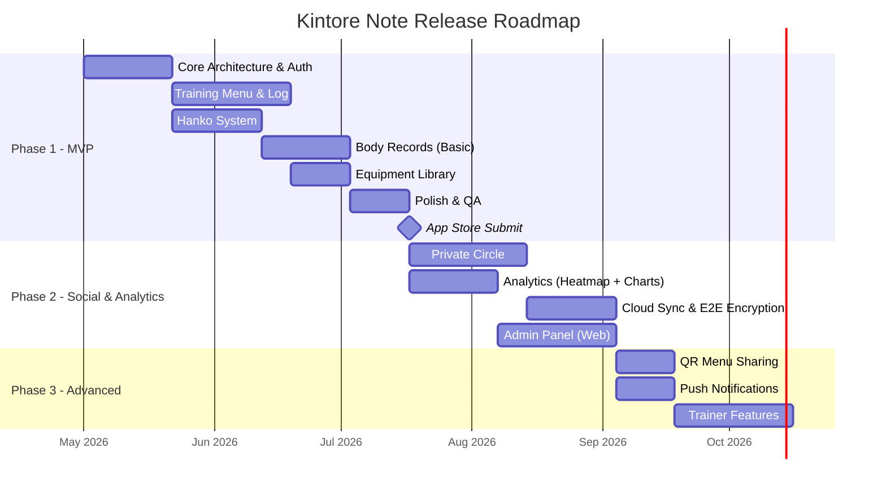
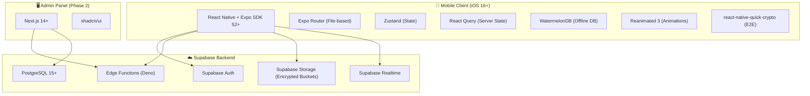
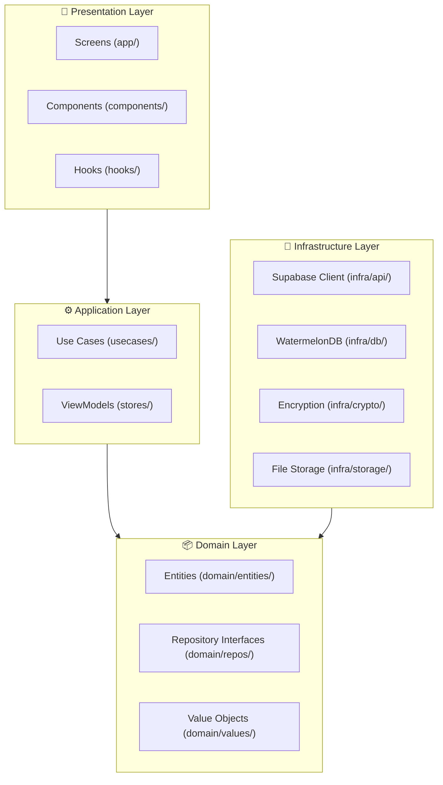
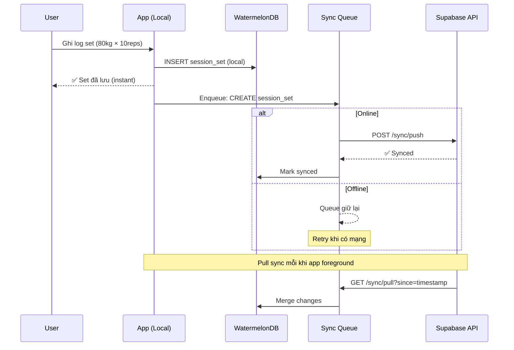
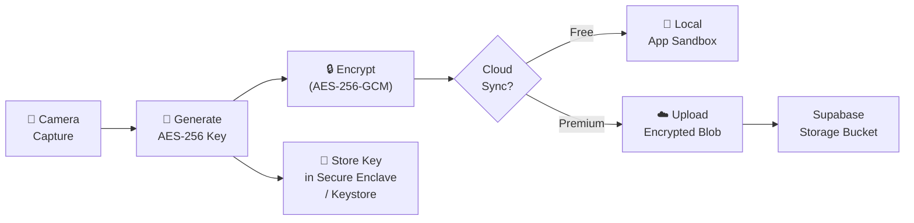
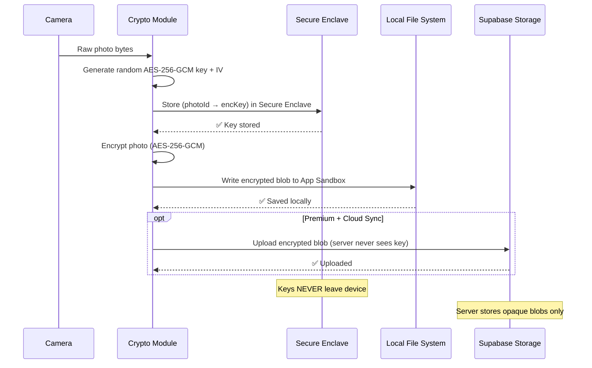

# 筋トレノート (Kintore Note) — Technical Specification

> **Phiên bản:** 1.1  
> **Ngày tạo:** 2026-04-19  
> **Cập nhật:** 2026-04-19 (v1.1 — Requirement Changes)  
> **Tham chiếu:** [Business Analysis v1.2](file:///d:/Workspace/kintore-note/docs/business-analysis.md)  
> **Trạng thái:** Updated

---

## Mục lục

1. [MVP Scope & Phasing](#1-mvp-scope--phasing)
2. [Tech Stack](#2-tech-stack)
3. [System Architecture](#3-system-architecture)
4. [Project Structure](#4-project-structure)
5. [Database Schema](#5-database-schema)
6. [API Design](#6-api-design)
7. [Screen Inventory & Navigation](#7-screen-inventory--navigation)
8. [Design System](#8-design-system)
9. [Security Architecture](#9-security-architecture)
10. [Offline Strategy](#10-offline-strategy)
11. [Verification Plan](#11-verification-plan)

---

## 1. MVP Scope & Phasing

### 1.1 Release Phases



### 1.2 Phase 1 — MVP (P0 Features)

> **Mục tiêu:** Người dùng có thể tạo menu tập, ghi log buổi tập, đóng dấu Hanko, và lưu ảnh body riêng tư. Hoạt động hoàn toàn offline.

| Module | Features (P0) | BA Reference |
|--------|--------------|-------------|
| **Auth** | Email + Apple Sign-In đăng ký/đăng nhập; **User ID `KINT-XXXX` tự generate bởi server** (không cho user đổi); Delete Account | FR-AUTH-01, 02, 05 |
| **Training Menu** | Template mẫu hệ thống; Custom Menu Builder; Copy Menu; Gán Menu vào lịch | FR-MENU-01, 02, 04, 05 |
| **Training Log** | Bàn phím số chuyên dụng; Tham chiếu lần trước; Rest Timer (foreground); Auto-save Draft; Session Summary | FR-LOG-01~04, 07 |
| **Hanko System** | Đóng dấu Hanko; Animation mực đỏ; Streak Tracking; Lịch Hanko Calendar | FR-HANKO-01~03, 05 |
| **Body Records** | Kho ảnh riêng tư encrypted; Góc chụp (Front/Side/Back) | FR-BODY-01, 03 |
| **Equipment Library** | Danh mục ≥100 bài tập; Tìm kiếm Katakana/Kanji/EN | FR-EQUIP-01, 03 |
| **Block & Report** | Chặn user, báo cáo nội dung | FR-SOCIAL-07 |

**Loại trừ khỏi MVP:**
- Private Circle (Feed, Comments, Reactions) → Phase 2
- Muscle Heatmap, Volume Chart, PR Tracking → Phase 2
- Cloud Sync ảnh body → Phase 2
- Ghost Overlay, Side-by-side Comparison → Phase 2
- QR Menu Sharing, Push Notifications → Phase 3
- Custom Hanko Name, Super Set, Streak Recovery, Weekly Summary → Phase 3

### 1.3 Phase 2 — Social & Analytics (P1 Features)

| Module | Features | Timeline |
|--------|---------|----------|
| **Private Circle** | Friend Request (free ≤ 3 friends, premium ≤ 50); Private Feed (ảnh + text); Reactions 💪🔥💮; Menu Sharing (in-app direct) | 4 tuần |
| **Training Program** | Tạo chương trình dài hạn (N tuần/tháng); phân Phase; lên lịch tự động theo tuần | 3 tuần |
| **Analytics** | Muscle Heatmap 2D; Volume Chart; PR Tracking (multi-category) | 3 tuần |
| **Body Records+** | Ghost Overlay; Side-by-side Comparison; Timeline View; Body Weight Log; Cloud Sync (E2E) | 3 tuần |
| **UX+** | Drag & Drop Menu; Ghi chú bài tập; Skip & Reorder; App Lock (Face ID); Profile; Custom exercises | 2 tuần |
| **Admin Panel** | Web dashboard: content management, moderation queue, user analytics | 4 tuần |

### 1.4 Phase 3 — Advanced (P2 Features)

| Module | Features |
|--------|---------|
| **Social+** | Comments; Block Hard-Hide; Unfriend |
| **Sharing** | QR Code Menu Sharing (72h expiry, 10 uses) |
| **Hanko+** | Custom Hanko Name; Streak Recovery (1x/month free, unlimited premium); Hanko Tier System |
| **Analytics+** | Weekly Summary |
| **Menu+** | Super Set / Circuit |
| **Notifications** | Training Reminder; Streak Alert; Friend Activity; Weekly Summary; PR Celebration |
| **Monetization** | Subscription tiers (Free / ¥480 Monthly / ¥1,900 Semi-annual / ¥4,800 Lifetime) |

---

## 2. Tech Stack

### 2.1 Tổng quan



### 2.2 Chi tiết lựa chọn

| Layer | Technology | Lý do |
|-------|-----------|-------|
| **Framework** | React Native + Expo SDK 52+ | Managed workflow; OTA updates; Expo Go cho dev nhanh; skills/building-native-ui guidelines |
| **Runtime** | Hermes (New Architecture) | Faster TTI; JSI cho native modules; concurrent React support |
| **Navigation** | Expo Router v4 (file-based) | NativeTabs; deep linking tự động; type-safe routing |
| **State (Client)** | Zustand | Atomic state; minimal re-renders; nhẹ (2KB); persist middleware |
| **State (Server)** | React Query (TanStack Query) | Cache, retry, background refetch; offline mutations |
| **Local DB** | WatermelonDB | Offline-first với sync protocol; lazy loading; 60fps scroll cho large datasets |
| **Animations** | Reanimated 3 + Gesture Handler | UI thread animations; gesture composition cho Hanko & Drag-Drop |
| **Encryption** | react-native-quick-crypto | AES-256-GCM; native JSI binding; nhanh hơn JS-based crypto |
| **Charts** | Victory Native + react-native-svg | Volume charts; customizable; performant |
| **Camera** | expo-camera | Camera API; self-timer; overlay support |
| **Haptics** | expo-haptics | Tactile feedback cho Hanko stamp |
| **Auth** | Supabase Auth | Apple Sign-In, Email; JWT; RLS integration |
| **Database** | Supabase PostgreSQL 15+ | RLS policies; realtime subscriptions; full-text search (JP) |
| **Storage** | Supabase Storage | Encrypted buckets; presigned URLs; CDN |
| **Edge Functions** | Supabase Edge Functions (Deno) | Serverless; custom logic; cron jobs |
| **Notifications** | expo-notifications + APNs | Local + remote; scheduling; iOS focus |
| **Localization** | i18next + react-i18next | JSON-based translations; pluralization; context |
| **Testing** | Jest + React Testing Library + Detox | Unit + Integration + E2E |

### 2.3 Dependency Matrix (MVP)

```
expo@~52.x
expo-router@~4.x
expo-camera@~16.x
expo-haptics@~13.x
expo-image@~2.x
expo-secure-store@~14.x
expo-crypto@~13.x

react-native-reanimated@~3.x
react-native-gesture-handler@~2.x
react-native-safe-area-context@~5.x

@supabase/supabase-js@~2.x
@tanstack/react-query@~5.x
zustand@~5.x
@nozbe/watermelondb@~0.28.x
react-native-quick-crypto@~0.7.x
react-native-svg@~15.x
victory-native@~41.x
i18next@~24.x
react-i18next@~15.x
```

---

## 3. System Architecture

### 3.1 Clean Architecture Layers



### 3.2 Offline-First Sync Engine



### 3.3 Encrypted Photo Pipeline



---

## 4. Project Structure

### 4.1 Expo Router File Layout

```
app/
├── _layout.tsx                          # Root: NativeTabs
├── (home,record,body,circle,stats)/     # Shared group (5 tabs)
│   ├── _layout.tsx                      # Stack navigator
│   ├── home.tsx                         # 🏠 Home (Hanko Calendar + Today)
│   ├── record.tsx                       # 📝 Training Log
│   ├── body.tsx                         # 📸 Body Records Gallery
│   ├── circle.tsx                       # 👥 Private Circle Feed
│   ├── stats.tsx                        # 📊 Analytics Dashboard
│   ├── exercise/[id].tsx               # Exercise detail (shared)
│   └── profile/[userId].tsx            # User profile (shared)
├── training/
│   ├── _layout.tsx                      # Stack
│   ├── session.tsx                      # Active training session
│   ├── menu-builder.tsx                 # Menu creator/editor
│   ├── menu-templates.tsx              # System templates
│   └── rest-timer.tsx                  # Modal: Rest timer
├── camera/
│   ├── _layout.tsx
│   ├── capture.tsx                      # Camera with Ghost Overlay
│   └── compare.tsx                     # Side-by-side comparison
├── auth/
│   ├── _layout.tsx
│   ├── login.tsx
│   ├── register.tsx
│   └── onboarding.tsx
├── settings/
│   ├── _layout.tsx
│   ├── index.tsx                        # Settings menu
│   ├── profile-edit.tsx
│   ├── notifications.tsx
│   ├── subscription.tsx
│   ├── language.tsx
│   └── account.tsx                     # Delete account
└── modals/
    ├── hanko-stamp.tsx                  # Hanko stamp animation
    ├── session-summary.tsx             # Post-workout summary
    ├── pr-celebration.tsx              # PR achievement
    └── friend-request.tsx              # Friend request
```

### 4.2 Source Code Layout

```
src/
├── components/                          # Shared UI components
│   ├── ui/                             # Atoms: Button, Input, Card, Badge
│   ├── training/                       # Training-specific: SetRow, ExerciseCard
│   ├── hanko/                          # HankoStamp, HankoCalendar, StreakBadge
│   ├── body/                           # PhotoCard, CompareSlider, GhostOverlay
│   ├── social/                         # PostCard, ReactionBar, CommentInput
│   ├── charts/                         # VolumeChart, MuscleHeatmap
│   └── layout/                         # TabBar, Header, EmptyState
│
├── stores/                             # Zustand stores
│   ├── auth.store.ts
│   ├── training.store.ts
│   ├── hanko.store.ts
│   ├── body.store.ts
│   ├── social.store.ts
│   └── settings.store.ts
│
├── hooks/                              # Custom hooks
│   ├── use-training-session.ts
│   ├── use-rest-timer.ts
│   ├── use-hanko-stamp.ts
│   ├── use-body-camera.ts
│   ├── use-offline-sync.ts
│   └── use-encryption.ts
│
├── domain/                             # Domain entities & interfaces
│   ├── entities/
│   │   ├── user.ts
│   │   ├── exercise.ts
│   │   ├── training-menu.ts
│   │   ├── training-session.ts
│   │   ├── session-set.ts
│   │   ├── hanko-stamp.ts
│   │   ├── body-photo.ts
│   │   └── post.ts
│   ├── repos/                          # Repository interfaces
│   │   ├── training.repo.ts
│   │   ├── hanko.repo.ts
│   │   ├── body.repo.ts
│   │   └── social.repo.ts
│   └── values/
│       ├── muscle-group.ts
│       ├── hanko-tier.ts
│       └── user-id.ts
│
├── infra/                              # Infrastructure implementations
│   ├── api/
│   │   ├── supabase.client.ts
│   │   ├── training.api.ts
│   │   ├── auth.api.ts
│   │   └── social.api.ts
│   ├── db/
│   │   ├── schema.ts                   # WatermelonDB schema
│   │   ├── models/                     # WatermelonDB models
│   │   └── sync.ts                     # Sync engine
│   ├── crypto/
│   │   ├── photo-encryption.ts         # AES-256-GCM
│   │   └── key-manager.ts             # Secure Enclave wrapper
│   └── storage/
│       └── photo-storage.ts            # Local encrypted file I/O
│
├── i18n/                               # Localization
│   ├── config.ts
│   ├── ja.json                         # 日本語 (default)
│   └── en.json                         # English
│
├── constants/
│   ├── colors.ts                       # Design tokens
│   ├── typography.ts
│   ├── spacing.ts
│   ├── exercises.ts                    # System exercise data
│   └── menu-templates.ts              # System menu templates
│
└── utils/
    ├── format.ts                       # Number/date formatting
    ├── validation.ts                   # User ID regex, input validation
    └── haptics.ts                      # Haptic feedback wrapper
```

---

## 5. Database Schema

### 5.1 Supabase PostgreSQL Schema

```sql
-- ============================================================
-- ENUMS
-- ============================================================
CREATE TYPE auth_provider AS ENUM ('apple', 'google', 'email');
CREATE TYPE locale_type AS ENUM ('ja', 'en');
CREATE TYPE weight_unit AS ENUM ('kg', 'lbs');
CREATE TYPE session_status AS ENUM ('draft', 'in_progress', 'completed');
CREATE TYPE photo_angle AS ENUM ('front', 'side_left', 'side_right', 'back');
CREATE TYPE hanko_tier AS ENUM ('bronze', 'silver', 'gold', 'platinum', 'master', 'legend');
CREATE TYPE friendship_status AS ENUM ('pending', 'accepted', 'blocked');
CREATE TYPE sub_plan AS ENUM ('monthly', 'semi_annual', 'lifetime');
CREATE TYPE sub_status AS ENUM ('active', 'expired', 'cancelled');
CREATE TYPE reaction_type AS ENUM ('muscle', 'fire', 'flower');

-- ============================================================
-- CORE TABLES
-- ============================================================

-- Users (extends Supabase Auth)
CREATE TABLE public.profiles (
    id UUID PRIMARY KEY REFERENCES auth.users(id) ON DELETE CASCADE,
    user_code VARCHAR(9) UNIQUE NOT NULL,          -- KINT-XXXX
    display_name VARCHAR(50) NOT NULL,
    avatar_url TEXT,
    bio VARCHAR(200),
    locale locale_type DEFAULT 'ja',
    weight_unit weight_unit DEFAULT 'kg',
    streak_current INT DEFAULT 0,
    streak_best INT DEFAULT 0,
    last_active_at TIMESTAMPTZ DEFAULT NOW(),
    created_at TIMESTAMPTZ DEFAULT NOW(),
    updated_at TIMESTAMPTZ DEFAULT NOW(),
    
    CONSTRAINT valid_user_code CHECK (user_code ~ '^KINT-[A-Z0-9]{4}$')
);

CREATE UNIQUE INDEX idx_profiles_user_code ON public.profiles(user_code);

-- Auto-generate unique KINT-XXXX on profile insert
CREATE OR REPLACE FUNCTION generate_user_code()
RETURNS VARCHAR AS $$
DECLARE
    code VARCHAR(9);
    chars TEXT := 'ABCDEFGHJKLMNPQRSTUVWXYZ23456789'; -- Remove ambiguous chars (0/O, 1/I)
BEGIN
    LOOP
        code := 'KINT-' || 
            substring(chars, floor(random() * length(chars) + 1)::int, 1) ||
            substring(chars, floor(random() * length(chars) + 1)::int, 1) ||
            substring(chars, floor(random() * length(chars) + 1)::int, 1) ||
            substring(chars, floor(random() * length(chars) + 1)::int, 1);
        EXIT WHEN NOT EXISTS (SELECT 1 FROM public.profiles WHERE user_code = code);
    END LOOP;
    RETURN code;
END;
$$ LANGUAGE plpgsql;

-- Muscle Groups
CREATE TABLE public.muscle_groups (
    id UUID PRIMARY KEY DEFAULT gen_random_uuid(),
    name_ja VARCHAR(50) NOT NULL,
    name_en VARCHAR(50) NOT NULL,
    body_region VARCHAR(20) NOT NULL,              -- upper/lower/core
    sort_order INT DEFAULT 0
);

-- Exercises
CREATE TABLE public.exercises (
    id UUID PRIMARY KEY DEFAULT gen_random_uuid(),
    name_ja VARCHAR(100) NOT NULL,
    name_en VARCHAR(100) NOT NULL,
    muscle_group_id UUID REFERENCES public.muscle_groups(id),
    secondary_muscle_ids UUID[] DEFAULT '{}',
    image_url TEXT,
    video_url TEXT,
    description_ja TEXT,
    description_en TEXT,
    search_text TSVECTOR,                          -- Full-text search (JP + EN)
    is_system BOOLEAN DEFAULT true,
    created_by UUID REFERENCES public.profiles(id),
    created_at TIMESTAMPTZ DEFAULT NOW()
);

CREATE INDEX idx_exercises_muscle ON public.exercises(muscle_group_id);
CREATE INDEX idx_exercises_search ON public.exercises USING GIN(search_text);

-- Training Programs (multi-week/month plans) 
CREATE TABLE public.training_programs (
    id UUID PRIMARY KEY DEFAULT gen_random_uuid(),
    user_id UUID REFERENCES public.profiles(id) ON DELETE CASCADE,
    name VARCHAR(100) NOT NULL,
    description TEXT,
    total_weeks INT NOT NULL CHECK (total_weeks BETWEEN 1 AND 52),
    start_date DATE,                               -- NULL = chưa lên lịch
    is_active BOOLEAN DEFAULT false,
    created_at TIMESTAMPTZ DEFAULT NOW(),
    updated_at TIMESTAMPTZ DEFAULT NOW()
);

CREATE INDEX idx_programs_user ON public.training_programs(user_id);

-- Training Menus
CREATE TABLE public.training_menus (
    id UUID PRIMARY KEY DEFAULT gen_random_uuid(),
    user_id UUID REFERENCES public.profiles(id) ON DELETE CASCADE,
    name VARCHAR(100) NOT NULL,
    is_template BOOLEAN DEFAULT false,
    schedule_days INT[] DEFAULT '{}',              -- 0=Mon, 6=Sun
    program_id UUID REFERENCES public.training_programs(id) ON DELETE SET NULL,
    program_week INT,                              -- Tuần thứ mấy trong program (1-based)
    created_at TIMESTAMPTZ DEFAULT NOW(),
    updated_at TIMESTAMPTZ DEFAULT NOW()
);

CREATE INDEX idx_menus_user ON public.training_menus(user_id);
CREATE INDEX idx_menus_program ON public.training_menus(program_id);

-- Menu Exercises (junction)
CREATE TABLE public.menu_exercises (
    id UUID PRIMARY KEY DEFAULT gen_random_uuid(),
    menu_id UUID REFERENCES public.training_menus(id) ON DELETE CASCADE,
    exercise_id UUID REFERENCES public.exercises(id),
    sort_order INT NOT NULL,
    target_sets INT DEFAULT 3,
    target_reps INT DEFAULT 10,
    target_weight_kg DECIMAL(6,2)
);

CREATE INDEX idx_menu_exercises_menu ON public.menu_exercises(menu_id);

-- Training Sessions
CREATE TABLE public.training_sessions (
    id UUID PRIMARY KEY DEFAULT gen_random_uuid(),
    user_id UUID REFERENCES public.profiles(id) ON DELETE CASCADE,
    menu_id UUID REFERENCES public.training_menus(id),
    started_at TIMESTAMPTZ NOT NULL DEFAULT NOW(),
    completed_at TIMESTAMPTZ,
    total_volume DECIMAL(10,2) DEFAULT 0,
    duration_minutes INT,
    status session_status DEFAULT 'draft',
    notes TEXT,
    created_at TIMESTAMPTZ DEFAULT NOW()
);

CREATE INDEX idx_sessions_user_date ON public.training_sessions(user_id, started_at DESC);

-- Session Sets
CREATE TABLE public.session_sets (
    id UUID PRIMARY KEY DEFAULT gen_random_uuid(),
    session_id UUID REFERENCES public.training_sessions(id) ON DELETE CASCADE,
    exercise_id UUID REFERENCES public.exercises(id),
    set_order INT NOT NULL,
    weight_kg DECIMAL(6,2) NOT NULL,
    reps INT NOT NULL,
    volume DECIMAL(10,2) GENERATED ALWAYS AS (weight_kg * reps) STORED,
    is_pr BOOLEAN DEFAULT false,
    rpe INT CHECK (rpe BETWEEN 1 AND 10),
    created_at TIMESTAMPTZ DEFAULT NOW()
);

CREATE INDEX idx_sets_session ON public.session_sets(session_id);
CREATE INDEX idx_sets_exercise ON public.session_sets(exercise_id, created_at DESC);

-- Hanko Stamps
CREATE TABLE public.hanko_stamps (
    id UUID PRIMARY KEY DEFAULT gen_random_uuid(),
    user_id UUID REFERENCES public.profiles(id) ON DELETE CASCADE,
    session_id UUID REFERENCES public.training_sessions(id),
    stamp_date DATE NOT NULL,
    hanko_tier hanko_tier DEFAULT 'bronze',
    streak_count INT DEFAULT 1,
    created_at TIMESTAMPTZ DEFAULT NOW(),
    
    CONSTRAINT unique_hanko_per_day UNIQUE(user_id, stamp_date)
);

CREATE INDEX idx_hanko_user_date ON public.hanko_stamps(user_id, stamp_date DESC);

-- Body Photos
CREATE TABLE public.body_photos (
    id UUID PRIMARY KEY DEFAULT gen_random_uuid(),
    user_id UUID REFERENCES public.profiles(id) ON DELETE CASCADE,
    encrypted_storage_key TEXT NOT NULL,            -- Path to encrypted blob
    angle photo_angle NOT NULL,
    body_weight_kg DECIMAL(5,1),
    taken_at TIMESTAMPTZ NOT NULL DEFAULT NOW(),
    created_at TIMESTAMPTZ DEFAULT NOW()
);

CREATE INDEX idx_photos_user_angle ON public.body_photos(user_id, angle, taken_at DESC);

-- Body Weight Log
CREATE TABLE public.body_weight_logs (
    id UUID PRIMARY KEY DEFAULT gen_random_uuid(),
    user_id UUID REFERENCES public.profiles(id) ON DELETE CASCADE,
    weight_kg DECIMAL(5,1) NOT NULL,
    logged_date DATE NOT NULL,
    created_at TIMESTAMPTZ DEFAULT NOW(),
    
    CONSTRAINT unique_weight_per_day UNIQUE(user_id, logged_date)
);

-- Friendships
CREATE TABLE public.friendships (
    id UUID PRIMARY KEY DEFAULT gen_random_uuid(),
    requester_id UUID REFERENCES public.profiles(id) ON DELETE CASCADE,
    addressee_id UUID REFERENCES public.profiles(id) ON DELETE CASCADE,
    status friendship_status DEFAULT 'pending',
    created_at TIMESTAMPTZ DEFAULT NOW(),
    accepted_at TIMESTAMPTZ,
    
    CONSTRAINT no_self_friend CHECK (requester_id != addressee_id),
    CONSTRAINT unique_friendship UNIQUE(requester_id, addressee_id)
);

CREATE INDEX idx_friendships_addressee ON public.friendships(addressee_id, status);

-- Posts (Private Feed)
CREATE TABLE public.posts (
    id UUID PRIMARY KEY DEFAULT gen_random_uuid(),
    user_id UUID REFERENCES public.profiles(id) ON DELETE CASCADE,
    session_id UUID REFERENCES public.training_sessions(id),
    photo_id UUID REFERENCES public.body_photos(id),
    title VARCHAR(100) NOT NULL,
    created_at TIMESTAMPTZ DEFAULT NOW()
);

CREATE INDEX idx_posts_user ON public.posts(user_id, created_at DESC);

-- Reactions
CREATE TABLE public.reactions (
    id UUID PRIMARY KEY DEFAULT gen_random_uuid(),
    post_id UUID REFERENCES public.posts(id) ON DELETE CASCADE,
    user_id UUID REFERENCES public.profiles(id) ON DELETE CASCADE,
    reaction reaction_type NOT NULL,
    created_at TIMESTAMPTZ DEFAULT NOW(),
    
    CONSTRAINT unique_reaction UNIQUE(post_id, user_id, reaction)
);

-- Comments
CREATE TABLE public.comments (
    id UUID PRIMARY KEY DEFAULT gen_random_uuid(),
    post_id UUID REFERENCES public.posts(id) ON DELETE CASCADE,
    user_id UUID REFERENCES public.profiles(id) ON DELETE CASCADE,
    content VARCHAR(200) NOT NULL,
    is_hidden BOOLEAN DEFAULT false,               -- Soft-delete for block
    created_at TIMESTAMPTZ DEFAULT NOW()
);

-- Subscriptions
CREATE TABLE public.subscriptions (
    id UUID PRIMARY KEY DEFAULT gen_random_uuid(),
    user_id UUID UNIQUE REFERENCES public.profiles(id) ON DELETE CASCADE,
    plan sub_plan NOT NULL,
    status sub_status DEFAULT 'active',
    started_at TIMESTAMPTZ NOT NULL DEFAULT NOW(),
    expires_at TIMESTAMPTZ,                        -- NULL for lifetime
    store_transaction_id VARCHAR(255) NOT NULL,
    price_jpy INT NOT NULL,
    created_at TIMESTAMPTZ DEFAULT NOW()
);

-- Notification Preferences
CREATE TABLE public.notification_prefs (
    id UUID PRIMARY KEY DEFAULT gen_random_uuid(),
    user_id UUID UNIQUE REFERENCES public.profiles(id) ON DELETE CASCADE,
    training_reminder BOOLEAN DEFAULT true,
    reminder_time TIME DEFAULT '18:00',
    reminder_days INT[] DEFAULT '{0,1,2,3,4}',     -- Mon-Fri
    streak_alert BOOLEAN DEFAULT true,
    friend_activity BOOLEAN DEFAULT true,
    weekly_summary BOOLEAN DEFAULT true,
    pr_celebration BOOLEAN DEFAULT true,
    quiet_start TIME DEFAULT '22:00',
    quiet_end TIME DEFAULT '07:00'
);

-- QR Share Links
CREATE TABLE public.qr_share_links (
    id UUID PRIMARY KEY DEFAULT gen_random_uuid(),
    menu_id UUID REFERENCES public.training_menus(id) ON DELETE CASCADE,
    created_by UUID REFERENCES public.profiles(id) ON DELETE CASCADE,
    share_code VARCHAR(16) UNIQUE NOT NULL,
    expires_at TIMESTAMPTZ NOT NULL,
    max_uses INT DEFAULT 10,
    use_count INT DEFAULT 0,
    created_at TIMESTAMPTZ DEFAULT NOW()
);

CREATE INDEX idx_qr_share_code ON public.qr_share_links(share_code);

-- ============================================================
-- TRIGGERS & FUNCTIONS
-- ============================================================

-- Auto-detect PR on set insert
CREATE OR REPLACE FUNCTION check_personal_record()
RETURNS TRIGGER AS $$
BEGIN
    IF NEW.weight_kg > COALESCE(
        (SELECT MAX(weight_kg) FROM public.session_sets 
         WHERE exercise_id = NEW.exercise_id 
         AND session_id != NEW.session_id
         AND id != NEW.id),
        0
    ) THEN
        NEW.is_pr := true;
    END IF;
    RETURN NEW;
END;
$$ LANGUAGE plpgsql;

CREATE TRIGGER trg_check_pr
    BEFORE INSERT ON public.session_sets
    FOR EACH ROW EXECUTE FUNCTION check_personal_record();

-- Auto-calculate session total volume
CREATE OR REPLACE FUNCTION update_session_volume()
RETURNS TRIGGER AS $$
BEGIN
    UPDATE public.training_sessions 
    SET total_volume = (
        SELECT COALESCE(SUM(volume), 0) 
        FROM public.session_sets 
        WHERE session_id = NEW.session_id
    )
    WHERE id = NEW.session_id;
    RETURN NEW;
END;
$$ LANGUAGE plpgsql;

CREATE TRIGGER trg_update_volume
    AFTER INSERT OR UPDATE ON public.session_sets
    FOR EACH ROW EXECUTE FUNCTION update_session_volume();

-- Full-text search index update
CREATE OR REPLACE FUNCTION update_exercise_search()
RETURNS TRIGGER AS $$
BEGIN
    NEW.search_text := 
        to_tsvector('simple', COALESCE(NEW.name_ja, '')) ||
        to_tsvector('english', COALESCE(NEW.name_en, ''));
    RETURN NEW;
END;
$$ LANGUAGE plpgsql;

CREATE TRIGGER trg_exercise_search
    BEFORE INSERT OR UPDATE ON public.exercises
    FOR EACH ROW EXECUTE FUNCTION update_exercise_search();
```

### 5.2 Row Level Security (RLS)

```sql
-- Enable RLS on all tables
ALTER TABLE public.profiles ENABLE ROW LEVEL SECURITY;
ALTER TABLE public.training_menus ENABLE ROW LEVEL SECURITY;
ALTER TABLE public.training_sessions ENABLE ROW LEVEL SECURITY;
ALTER TABLE public.session_sets ENABLE ROW LEVEL SECURITY;
ALTER TABLE public.hanko_stamps ENABLE ROW LEVEL SECURITY;
ALTER TABLE public.body_photos ENABLE ROW LEVEL SECURITY;
ALTER TABLE public.posts ENABLE ROW LEVEL SECURITY;
ALTER TABLE public.friendships ENABLE ROW LEVEL SECURITY;

-- Profiles: users can read friends, edit own
CREATE POLICY "profiles_select_own" ON public.profiles
    FOR SELECT USING (auth.uid() = id);
CREATE POLICY "profiles_select_friends" ON public.profiles
    FOR SELECT USING (
        id IN (
            SELECT CASE 
                WHEN requester_id = auth.uid() THEN addressee_id 
                ELSE requester_id 
            END FROM public.friendships 
            WHERE status = 'accepted' 
            AND (requester_id = auth.uid() OR addressee_id = auth.uid())
        )
    );
CREATE POLICY "profiles_update_own" ON public.profiles
    FOR UPDATE USING (auth.uid() = id);

-- Training data: only own data
CREATE POLICY "training_own" ON public.training_sessions
    FOR ALL USING (auth.uid() = user_id);
CREATE POLICY "sets_own" ON public.session_sets
    FOR ALL USING (
        session_id IN (SELECT id FROM public.training_sessions WHERE user_id = auth.uid())
    );

-- Body photos: strictly own only
CREATE POLICY "photos_own" ON public.body_photos
    FOR ALL USING (auth.uid() = user_id);

-- Posts: visible to friends only
CREATE POLICY "posts_friends" ON public.posts
    FOR SELECT USING (
        user_id = auth.uid() OR
        user_id IN (
            SELECT CASE 
                WHEN requester_id = auth.uid() THEN addressee_id 
                ELSE requester_id 
            END FROM public.friendships 
            WHERE status = 'accepted'
            AND (requester_id = auth.uid() OR addressee_id = auth.uid())
        )
    );
CREATE POLICY "posts_insert_own" ON public.posts
    FOR INSERT WITH CHECK (auth.uid() = user_id);
```

---

## 6. API Design

### 6.1 Supabase Edge Functions

| # | Function | Method | Mô tả | Phase |
|---|----------|--------|-------|-------|
| 1 | `/auth/register` | POST | Tạo profile + **auto-generate** `KINT-XXXX` unique | MVP |
| 2 | `/training/copy-menu` | POST | Clone menu + map exercises | MVP |
| 3 | `/training/complete-session` | POST | Finalize session + stamp Hanko + update streak | MVP |
| 4 | `/training/session-summary` | GET | Tóm tắt + so sánh vs lần trước | MVP |
| 5 | `/exercises/search` | GET | Full-text search (JP+EN) | MVP |
| 6 | `/hanko/stamp` | POST | Đóng dấu + streak logic + tier check | MVP |
| 7 | `/hanko/calendar` | GET | Lịch Hanko theo tháng | MVP |
| 8 | `/programs/create` | POST | Tạo Training Program (multi-week) | P2 |
| 9 | `/programs/[id]/schedule` | GET | Lấy lịch menu theo tuần hiện tại | P2 |
| 10 | `/body/upload` | POST | Upload encrypted blob + metadata | P2 |
| 11 | `/social/find-user` | GET | Tìm user theo KINT-XXXX | P2 |
| 12 | `/social/friend-request` | POST | Gửi/chấp nhận/từ chối lời mời | P2 |
| 13 | `/social/feed` | GET | Paginated friend feed | P2 |
| 14 | `/social/block` | POST | Block + hard-hide interactions | P2 |
| 15 | `/analytics/heatmap` | GET | Volume theo muscle group + date range | P2 |
| 16 | `/analytics/volume-chart` | GET | Time-series volume cho exercise | P2 |
| 17 | `/sharing/create-qr` | POST | Tạo QR share link (72h, 10 uses) | P3 |
| 18 | `/sharing/import-menu` | POST | Import menu từ share code | P3 |

### 6.2 Realtime Subscriptions

```typescript
// Feed updates (Phase 2)
supabase
  .channel('friend-feed')
  .on('postgres_changes', {
    event: 'INSERT',
    schema: 'public',
    table: 'posts',
    filter: `user_id=in.(${friendIds.join(',')})`,
  }, handleNewPost)
  .subscribe();

// Friend requests (Phase 2)
supabase
  .channel('friend-requests')
  .on('postgres_changes', {
    event: 'INSERT',
    schema: 'public',
    table: 'friendships',
    filter: `addressee_id=eq.${userId}`,
  }, handleFriendRequest)
  .subscribe();
```

---

## 7. Screen Inventory & Navigation

### 7.1 Tab Navigation

```mermaid
graph TB
    subgraph Tabs["📱 Bottom Tabs (NativeTabs)"]
        T1["🏠 ホーム\nHome"]
        T2["📝 記録\nRecord"]
        T3["📸 ボディ\nBody"]
        T4["👥 サークル\nCircle"]
        T5["📊 分析\nStats"]
    end

    T1 --> H1["Hanko Calendar"]
    T1 --> H2["Today's Menu Preview"]
    T1 --> H3["Streak Counter"]

    T2 --> R1["Active Session"]
    T2 --> R2["Menu Builder"]
    T2 --> R3["Menu Templates"]
    T2 --> R4["Exercise Library"]

    T3 --> B1["Photo Gallery"]
    T3 --> B2["Camera + Ghost Overlay"]
    T3 --> B3["Side-by-side Compare"]
    T3 --> B4["Weight Chart"]

    T4 --> C1["Friend Feed"]
    T4 --> C2["Friend List"]
    T4 --> C3["Add Friend"]

    T5 --> S1["Muscle Heatmap"]
    T5 --> S2["Volume Charts"]
    T5 --> S3["PR Records"]
```



### 7.2 Screen Inventory

| # | Screen | Route | Phase | Mô tả |
|---|--------|-------|-------|-------|
| 1 | Home | `/(tabs)/home` | MVP | Hanko calendar grid + Today's menu + Streak badge |
| 2 | Training Session | `/training/session` | MVP | Active workout: bàn phím số + set list + rest timer |
| 3 | Menu Builder | `/training/menu-builder` | MVP | Tạo/sửa menu: exercise picker + drag reorder |
| 4 | Menu Templates | `/training/menu-templates` | MVP | Lịch mẫu hệ thống phân loại theo level |
| 5 | Exercise Library | `/(tabs)/record/exercises` | MVP | Danh mục bài tập + search |
| 6 | Exercise Detail | `/exercise/[id]` | MVP | Hình ảnh + video + hướng dẫn |
| 7 | Hanko Stamp | `/modals/hanko-stamp` | MVP | Full-screen animation đóng dấu |
| 8 | Session Summary | `/modals/session-summary` | MVP | Tóm tắt buổi tập + prompt chụp body |
| 9 | Body Gallery | `/(tabs)/body` | MVP | Timeline ảnh body + filter góc |
| 10 | Body Camera | `/camera/capture` | MVP | Camera + ghost overlay + timer |
| 11 | Login | `/auth/login` | MVP | Email + Apple Sign-In |
| 12 | Register | `/auth/register` | MVP | Tạo tài khoản — hệ thống hiển thị User ID đã generate |
| 13 | Onboarding | `/auth/onboarding` | MVP | Chọn goal + level + menu mẫu |
| 14 | Settings | `/settings/` | MVP | Cài đặt chung |
| 15 | Account | `/settings/account` | MVP | Xóa tài khoản |
| 16 | PR Celebration | `/modals/pr-celebration` | P2 | Full-screen PR achievement |
| 17 | Side-by-side | `/camera/compare` | P2 | So sánh ảnh body |
| 18 | Private Feed | `/(tabs)/circle` | P2 | Friend posts timeline |
| 19 | Add Friend | `/circle/add-friend` | P2 | Nhập KINT-XXXX của bạn bè |
| 20 | Friend Profile | `/profile/[userId]` | P2 | Profile bạn bè |
| 21 | Muscle Heatmap | `/(tabs)/stats` | P2 | Mô hình cơ thể 2D |
| 22 | Volume Chart | `/stats/volume/[exerciseId]` | P2 | Biểu đồ exercise |
| 23 | Program Builder | `/training/program-builder` | P2 | Tạo/sửa Training Program dài hạn |
| 24 | Program Detail | `/training/program/[id]` | P2 | Xem lịch trình theo tuần của program |
| 25 | Notification Settings | `/settings/notifications` | P3 | Cài đặt thông báo |
| 26 | Subscription | `/settings/subscription` | P3 | Gói premium |
| 27 | QR Share | `/training/qr-share` | P3 | Tạo/hiển thị QR code |
| 28 | Profile Edit | `/settings/profile-edit` | P2 | Sửa tên, avatar, bio |

### 7.3 Key Screen Wireframes

#### Home Screen (ホーム)
```
┌─────────────────────────────────┐
│  筋トレノート     ⚙️ Settings   │  ← Stack header
├─────────────────────────────────┤
│                                 │
│  🔥 14日連続！ (14-day streak)  │  ← Streak badge
│                                 │
│  ┌──────────────────────────┐   │
│  │   2026年4月              │   │  ← Hanko Calendar
│  │ 月  火  水  木  金  土  日│   │
│  │  1   2   3   4   5   6  7│   │
│  │ 🔴  ·  🔴  ·  🔴  ·   · │   │
│  │  8   9  10  11  12  13 14│   │
│  │ 🔴  ·  🔴  ·  🔴  ·   · │   │
│  │ 15  16  17  18  19       │   │
│  │ 🔴  ·  🔴  ·  ⭕        │   │  ← ⭕ = Today (chưa tập)
│  └──────────────────────────┘   │
│                                 │
│  ┌──────────────────────────┐   │
│  │ 📋 今日のメニュー         │   │  ← Today's Menu
│  │ 胸の日 (Chest Day)       │   │
│  │ ・ベンチプレス 3×10       │   │
│  │ ・ダンベルフライ 3×12     │   │
│  │ ・インクラインプレス 3×10  │   │
│  │                          │   │
│  │ [ トレーニング開始 💪 ]    │   │  ← CTA Button
│  └──────────────────────────┘   │
│                                 │
├─────────────────────────────────┤
│ 🏠  📝  📸  👥  📊           │  ← Tab Bar
└─────────────────────────────────┘
```

#### Training Session (記録)
```
┌─────────────────────────────────┐
│  ← 胸の日        ⏱ 45:23       │  ← Timer + back
├─────────────────────────────────┤
│                                 │
│  ベンチプレス (Bench Press)      │  ← Exercise name
│  前回: 75kg × 10 reps           │  ← Last session ref
│                                 │
│  ┌────────────────────────────┐ │
│  │ Set 1  ✅  75.0kg × 10    │ │  ← Completed set
│  │ Set 2  ✅  77.5kg × 8     │ │
│  │ Set 3  ⬜  ___kg  × __    │ │  ← Active set
│  └────────────────────────────┘ │
│                                 │
│  ┌────────────────────────────┐ │
│  │         [ 77.5 ] kg        │ │  ← Custom numpad
│  │  [-5] [-2.5] [-1.25]      │ │
│  │  [+1.25] [+2.5] [+5]      │ │
│  │                            │ │
│  │         [ 10 ] reps        │ │
│  │     [-1]    [+1]           │ │
│  │                            │ │
│  │    [ 記録 (Save Set) ]     │ │  ← Primary action
│  └────────────────────────────┘ │
│                                 │
│  ┌──────┐  ┌──────────────┐    │
│  │スキップ│  │次の種目 →     │    │  ← Skip / Next
│  └──────┘  └──────────────┘    │
└─────────────────────────────────┘
```

---

## 8. Design System

### 8.1 Color Tokens

```typescript
// constants/colors.ts
export const colors = {
  // Dark theme (default)
  dark: {
    bg: {
      primary: '#0A0A0A',         // App background
      secondary: '#141414',       // Card background
      tertiary: '#1E1E1E',        // Input background
      elevated: '#242424',        // Modal/sheet background
    },
    text: {
      primary: '#F5F5F5',         // Main text
      secondary: '#A0A0A0',       // Subtle text
      tertiary: '#666666',        // Disabled text
      inverse: '#0A0A0A',         // Text on light bg
    },
    accent: {
      primary: '#E54D42',         // Hanko red (朱色)
      secondary: '#FF6B5B',       // Lighter accent
      success: '#34C759',         // Complete/PR
      warning: '#FF9500',         // Attention
      info: '#5AC8FA',            // Info
    },
    border: {
      default: '#2A2A2A',         // Card borders
      subtle: '#1A1A1A',          // Dividers
      focus: '#E54D42',           // Focus rings
    },
    hanko: {
      ink: '#C41E1E',             // Hanko stamp ink
      inkLight: '#E54D42',        // Hanko highlight
      paper: '#FFF8F0',           // Stamp paper texture
    },
  },
  
  // Reaction colors
  reactions: {
    muscle: '#FF6B35',            // 💪
    fire: '#FF4444',              // 🔥
    flower: '#FF69B4',            // 💮
  },
} as const;
```

### 8.2 Typography

```typescript
// constants/typography.ts
export const typography = {
  fontFamily: {
    ja: 'NotoSansJP',            // System fallback: Hiragino Sans
    en: 'SF Pro Text',           // System font
    mono: 'SF Mono',             // Numbers in timer/sets
  },
  
  fontSize: {
    xs: 11,
    sm: 13,
    base: 15,
    md: 17,
    lg: 20,
    xl: 24,
    '2xl': 28,
    '3xl': 34,
    '4xl': 40,
    hero: 56,                    // Streak number, Timer
  },
  
  fontWeight: {
    regular: '400' as const,
    medium: '500' as const,
    semibold: '600' as const,
    bold: '700' as const,
    heavy: '800' as const,
  },
  
  lineHeight: {
    tight: 1.2,
    normal: 1.5,
    relaxed: 1.75,
  },
} as const;
```

### 8.3 Spacing & Radius

```typescript
// constants/spacing.ts
export const spacing = {
  xs: 4,
  sm: 8,
  md: 12,
  base: 16,
  lg: 20,
  xl: 24,
  '2xl': 32,
  '3xl': 40,
  '4xl': 48,
} as const;

export const radius = {
  sm: 6,
  md: 10,
  lg: 14,
  xl: 20,
  full: 9999,
} as const;
```

---

## 9. Security Architecture

### 9.1 Encryption Flow (Body Photos)



### 9.2 Key Management

| Platform | Storage | Backup |
|----------|---------|--------|
| iOS | Secure Enclave (via `expo-secure-store`) | iCloud Keychain (opt-in) |
| Android | Android Keystore | Google Auto Backup (encrypted) |

### 9.3 App Lock

```typescript
// Biometric authentication flow
import * as LocalAuthentication from 'expo-local-authentication';

async function authenticateUser(): Promise<boolean> {
  const hasHardware = await LocalAuthentication.hasHardwareAsync();
  if (!hasHardware) return true; // Skip on unsupported devices
  
  const result = await LocalAuthentication.authenticateAsync({
    promptMessage: '筋トレノートのロックを解除',  // Unlock Kintore Note
    fallbackLabel: 'パスコードを使用',            // Use passcode
    disableDeviceFallback: false,
  });
  
  return result.success;
}
```

---

## 10. Offline Strategy

### 10.1 WatermelonDB Local Schema

```typescript
// infra/db/schema.ts
import { appSchema, tableSchema } from '@nozbe/watermelondb';

export const schema = appSchema({
  version: 1,
  tables: [
    tableSchema({
      name: 'training_sessions',
      columns: [
        { name: 'server_id', type: 'string', isOptional: true },
        { name: 'menu_id', type: 'string', isOptional: true },
        { name: 'started_at', type: 'number' },
        { name: 'completed_at', type: 'number', isOptional: true },
        { name: 'total_volume', type: 'number' },
        { name: 'status', type: 'string' },
        { name: 'synced', type: 'boolean' },
      ],
    }),
    tableSchema({
      name: 'session_sets',
      columns: [
        { name: 'server_id', type: 'string', isOptional: true },
        { name: 'session_id', type: 'string' },
        { name: 'exercise_id', type: 'string' },
        { name: 'set_order', type: 'number' },
        { name: 'weight_kg', type: 'number' },
        { name: 'reps', type: 'number' },
        { name: 'is_pr', type: 'boolean' },
        { name: 'synced', type: 'boolean' },
      ],
    }),
    tableSchema({
      name: 'hanko_stamps',
      columns: [
        { name: 'server_id', type: 'string', isOptional: true },
        { name: 'session_id', type: 'string' },
        { name: 'stamp_date', type: 'string' },
        { name: 'hanko_tier', type: 'string' },
        { name: 'streak_count', type: 'number' },
        { name: 'synced', type: 'boolean' },
      ],
    }),
    // ... other tables follow same pattern
  ],
});
```

### 10.2 Sync Strategy

| Data Type | Sync Direction | Conflict Resolution | Priority |
|-----------|---------------|-------------------|----------|
| Training Sessions | Bi-directional | Last-Write-Wins (client timestamp) | 🔴 High |
| Session Sets | Bi-directional | Last-Write-Wins | 🔴 High |
| Hanko Stamps | Push (client → server) | Client wins (1 stamp/day constraint) | 🔴 High |
| Body Photos | Push (client → server) | Client wins (new photos only) | 🟡 Medium |
| Training Menus | Bi-directional | Last-Write-Wins | 🟡 Medium |
| Social (Posts, Comments) | Pull (server → client) | Server wins | 🟢 Low |
| Profile | Bi-directional | Server wins | 🟢 Low |

### 10.3 Sync Queue

```typescript
// Sync khi app trở lại foreground
import { AppState } from 'react-native';
import NetInfo from '@react-native-community/netinfo';

AppState.addEventListener('change', async (state) => {
  if (state === 'active') {
    const { isConnected } = await NetInfo.fetch();
    if (isConnected) {
      await syncEngine.pushPendingChanges();  // Push local changes
      await syncEngine.pullRemoteChanges();   // Pull server changes
    }
  }
});
```

---

## 11. Verification Plan

### 11.1 Testing Strategy

| Level | Tool | Coverage Target | Scope |
|-------|------|----------------|-------|
| **Unit** | Jest + React Testing Library | ≥80% | Domain logic, utils, hooks |
| **Integration** | Jest + MSW (API mocking) | ≥70% | Store ↔ API, Sync engine |
| **E2E** | Detox | Critical paths | Login → Record → Hanko → Body Photo |
| **Visual** | Snapshot tests | Key components | Design system components |

### 11.2 Critical E2E Test Cases

```
TC-01: Onboarding → Login → Home
TC-02: Create Menu → Start Session → Log Sets → Complete → Hanko Stamp
TC-03: Capture Body Photo → Verify NOT in Camera Roll → View in Gallery
TC-04: Offline: Log Sets → Kill App → Reopen → Resume Session
TC-05: Copy Menu from last week → Verify values populated
TC-06: Search Exercise (JP Katakana) → View Detail → Add to Menu
TC-07: Delete Account → Verify all data removed
```

### 11.3 Performance Benchmarks

| Metric | Target | Tool |
|--------|--------|------|
| Cold Start (TTI) | ≤ 2.0s | `react-native-performance` |
| Set Logging (input → saved) | ≤ 3 taps, < 500ms | Manual + E2E timing |
| Photo Encryption | ≤ 500ms / 5MB photo | Benchmark test |
| Hanko Stamp Animation | 60fps, no drops | Reanimated perf monitor |
| Calendar Render (365 days) | < 100ms | React DevTools Profiler |
| Exercise Search | < 200ms response | API benchmark |

### 11.4 App Store Checklist

- [ ] APPI (個人情報保護法) compliance — Privacy Policy (JP)
- [ ] Apple Sign-In working (mandatory for App Store)
- [ ] Delete Account flow (App Store requirement)
- [ ] Privacy Nutrition Labels configured in App Store Connect
- [ ] Photo usage description (NSCameraUsageDescription) — JP localized
- [ ] No background location/activity tracking
- [ ] Dark Mode properly supported
- [ ] Accessibility labels on all interactive elements
- [ ] App icon, screenshots (6.7" + 5.5") in Japanese
- [ ] Keyword optimization for 筋トレ, トレーニング, 記録

---

> [!NOTE]
> **Bước tiếp theo sau khi approved:**
> 1. Khởi tạo Expo project (`npx create-expo-app`)
> 2. Setup Supabase project + migrate schema
> 3. Implement Design System (colors, typography, components)
> 4. Build Auth flow (Login + Register + Onboarding)
> 5. Build Training Menu module
> 6. Build Training Log module + Bàn phím số
> 7. Build Hanko System + Animations
> 8. Build Body Records (Camera + Encrypted Storage)
> 9. QA + App Store submission
